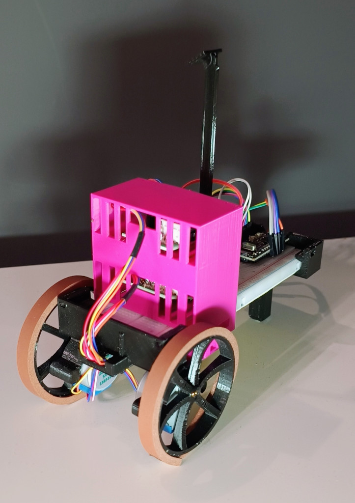
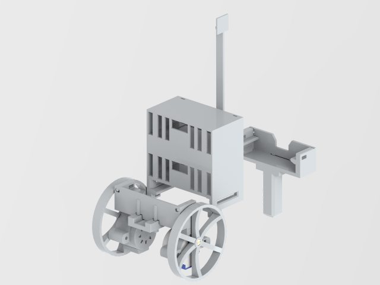
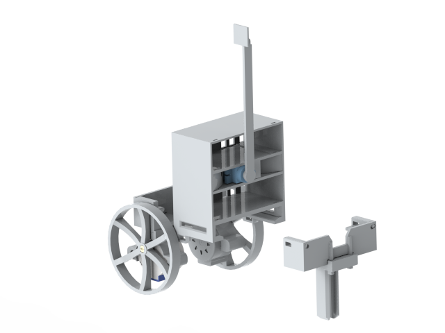

# Tutorial overview

## Introduction

Have you ever dreamed of making your own electronic device? 
Do you think it's a difficult task and requires at least a PhD in electronics?
Well, we no longer live in *Stone Age* and there is no need to chisel transistors out of a silicon wafer. There are way better solutions on the market nowadays.

This tutorial presents an affordable way to your very first robotics. For ~€20-25 you can build your own robot that actually can fight! 

 Figure: Completed robot, photo

> [!IMPORTANT]
> This tutorial assumes you have basic familiarity with one of C-like languages: C, C++, Java, JavaScript, Python.

This tutorial shall follow DRY principle: Don't Repeat Yourself. If there's a good resource, I'll simply point you there.

## Table of contents 
* [Hello World](chapters/0_hello_world.md)
  * Never seen an IDE? Want to test your set up? Come here!
* [I/O handling](chapters/1_io_handling.md)
  *  How to control pins in your board? Start here!
* [Analog input, Pulse Width Modulation](chapters/2_analog_and_pwm.md)
  * Life in between 0V and 5V
* [UART](chapters/3_uart.md)
  * Data transfer between PC and microcontroller
* [Controlling Stepper Motors](chapters/4_stepper_motor.md)
  * *You spin me right round round round...*
  * Full Step, Half Step, Arduino libraries
* [Controlling Servos](chapters/5_servo.md)
  * Torque and angle with a servo
* [Integrating knowledge - Building a robot!](chapters/6_robot_integration.md)
  * You are familiar with the basics by now. It's time to make a robot!

Your best friend during the course - [Atmega328P Datasheet](https://ww1.microchip.com/downloads/en/DeviceDoc/Atmel-7810-Automotive-Microcontrollers-ATmega328P_Datasheet.pdf)!

## Bill of materials

To complete the tutorial, you'll need:

* 1x justPi 830 breadboard (or other with compatible dimension)
* 1x Cytron Nano board (Arduino Nano board is a good choice too, though provides fewer features)
* 2x 28BYJ-48 stepper motors with ULN2003 driver (Darlington amp)
* 1x SG-92R servo (or similar)
* 1x set of jumper leads
* 1x set of resistors
* 1x set of LEDs
* 1x photoresistor 
* 1x microUSB cable
* 1x push button (optionally)
* 1x set of 3D printed elements (see below)

> [!NOTE]
> If you just want to learn basics you can complete the introductory chapters with only
> one stepper motor. You also don't need to 3d-print anything in that case!

## Bill of Materials: 3D printed elements
To complete the tutorial and build a robot, you'll need:

* 1x chassis_front_beam.stl 
* 1x chassis_rear_beam_with_airsoft_bearing.stl 
* 1x front_wall.stl  
* 1x rear_wall.stl 
* 2x stepper_motor_case.stl 
* 2x wheel.stl
* 1x driver_tower_with_servo.stl
* 1x servo_arm.stl
* 1x servo_arm_effector.stl
* 1x servo_holder.stl

Additionally:
* 1x plastic 6mm airsoft BB
  * That's your bearing and a part of the rear axle
* rubber strips to form a tyre (adhesive required). I used a window gasket/seal for this purpose. 
You can also cut a piece of a bicycle inner tube (so called *ranger band*). It fits perfectly and does
not require adhesives.
* Glue
* Some basic tools
* electrical tape
* a few zip ties can be quite handy too. Alternatively, you can use ancient technique of 
[cable lacing](https://en.wikipedia.org/wiki/Cable_lacing). After all, it's a formal NASA [NASA-STD-8739.4](https://s3vi.ndc.nasa.gov/ssri-kb/static/resources/nasa-std-8739.4a.pdf) standard.
Take a look at [NASA's website](https://workmanship.nasa.gov/lib/insp/2%20books/links/sections/401%20General%20Requirements.html).

All STL files can be downloaded from this tutorial repository: [3d_models](https://github.com/krkruk/arduino-robot-tutorial/tree/master/3d_models). 

The robot has been design to require no screws, bolts, anything. It's ugly but functional :).
Printing instruction:

* PLA is good enough. Some elements require precision of ~0.1mm 
* 6-10% fill
* 2 line wall thickness

Once you print all the parts, you'll have a robot that resembles the render photos below:

 Figure: Front render

 Figure: Rear render

## Integrated development environment

You need to install an integrated development environment to start developing your programs ASAP. It's the easiest and fastest way (of course you can use a standalone AVR Toolchain[^1] and AVRDude [^2]... it's your choice but make sure you have plenty of time and tenacity).

Since it's a quick way to get you started I suggest you install both, yes both, environments:

* VSCode/VSCodium + PlatformIO plugin. This is how you can do it: 
[Installation tutorial](https://docs.platformio.org/en/latest/integration/ide/vscode.html#ide-vscode)
* Arduino IDE - [download page here](https://www.arduino.cc/en/software)

Why two IDEs? Well, Arduino IDE is so simple that it's a very nice place to start. Lots of 
pre-installed examples that you can simply run. All toolchains install automatically (AVR, ARM, etc.). 
It provides an easy to use terminal to see UART data (refer to [UART](chapters/3_uart.md)). However, 
anything bigger than one file tends to be more and more difficult to maintain. 

VSCode is an advanced text editor that can work quite nicely as an IDE if you configure it properly. 
*PlatformIO* provides support for most of development boards available on the market. It also handles 
external dependencies quite well, so you don't need to download 3rd party libraries on your own. It 
all comes with a greater complexity and is slightly more difficult to use. Just slightly.

Now, sometimes it's easier to compile software in Arduino IDE than in VSCode. You download a lib, 
compile, and run. VSCode can sometimes be a pain in this aspect. So Arduino IDE is also a good tool 
for any quick debugging you may need.

## TL;DR; Skip tutorial, give me a robot

If you are impatient and want the robot now without following the tutorial,
here are all the steps you need to create your robot.

* 3d-print all elements you find in [`3d_models`](https://github.com/krkruk/arduino-robot-tutorial/tree/master/3d_models) directory. Use \*.stl files. Then, follow the assemble instructions
as provided in [Integrating knowledge - Building a robot!](chapters/6_robot_integration.md) chapter.
  in your favorite slicer software
* Follow the pinout as shown in the table
* Install the software on your Cytron board. Use README file distributed alongside
  the source code. Final code can be found [here](https://github.com/krkruk/arduino-robot-tutorial/tree/master/mini-robot/final_source_code).

**PINOUT**

| Device            | Arduino Pin |
| ----------------- | ----------- |
| Servo PWM line    | D9          |
| Right Stepper IN1 | D7          |
| Right Stepper IN2 | D6          |
| Right Stepper IN3 | D5          |
| Right Stepper IN4 | D4          |
| Left Stepper IN1  | PIN_A4      |
| Left Stepper IN2  | PIN_A3      |
| Left Stepper IN3  | PIN_A2      |
| Left Stepper IN4  | PIN_A1      |

## Disclaimer

All presented materials serve educational purposes only. Working with electricity
poses hazard to your health and life. If you decide to follow the tutorial,
you do it at your own risk. You can get destroy your electronic components (i.e., ESD - electrostatic discharge), get electrocuted, burn down your surroundings. You have been warned!

Similarly, 3D printing comes with it's own risks. My first cheap 3D printer caught fire twice...
You need some basic skills to operate FDM/FFF printer. Please refer to your printer user
manual. Remember, you do it at your risk!

### References

[^1]: [GCC AVR Toolchain](https://www.microchip.com/en-us/tools-resources/develop/microchip-studio/gcc-compilers)
[^2]: [AVRDude](https://github.com/avrdudes/avrdude)
