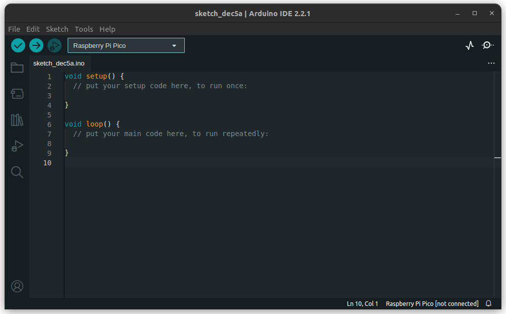
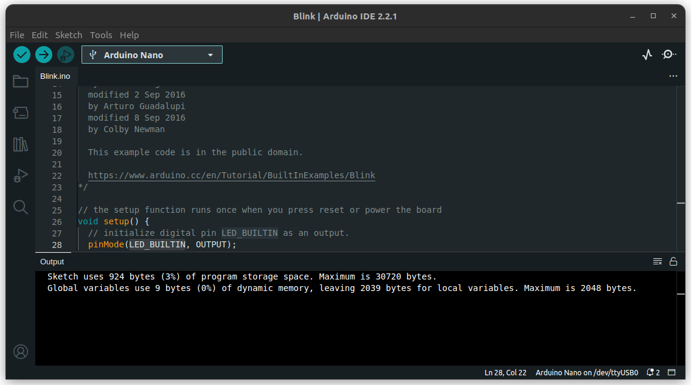

# Hello world!

This is a quick walkthrough to install your very first application on a microcontroller. It's the only section that does not require any software experience :)

## Arduino IDE
Launch your Arduino IDE, you should see something like this (AD2023):

Now click on the drop-down list and select '*Select other board and port...*':

Type in "Nano" and select non-default port:
* Windows: COM7 and other
* Linux: `ttyUSB0`, `ttyACM0`, anything other than `ttyS0`

You're doing well! By now, your IDE should be prepared for action. Let's compile an app. Go to 
`File -> Examples -> 01.Basics -> Blink`

The IDE shall present you a few lines of code that periodically turn on and turn off an LED that
comes with your dev board. Note `LED_BUILTIN` constant, we'll take about it later.

Now it's time to compile it! There are three buttons in your toolbar (the area under `File | Edit | Sketch | Tools | Help` menu bar). 

The tick button compiles your application. In other words, it translates the text you wrote (or 
in this case, simply downloaded) into a binary file.

The right arrow button compiles and upload the application to the device you selected earlier on a given port.

Click the right arrow button. As a result, you should see a window like this:

Take a look at your board! Do you see it! It's blinking! Good job, you've just become an embedded developer :)

More on Blink example can be found on Arduino website [^1].

## VSCode + PlatformIO project

\<\<TBD\>\>

More on Blink example can be found on Arduino website [^1].

## References

[^1]: [Arduino Blink Example - Full documentation](https://www.arduino.cc/en/Tutorial/BuiltInExamples/Blink)