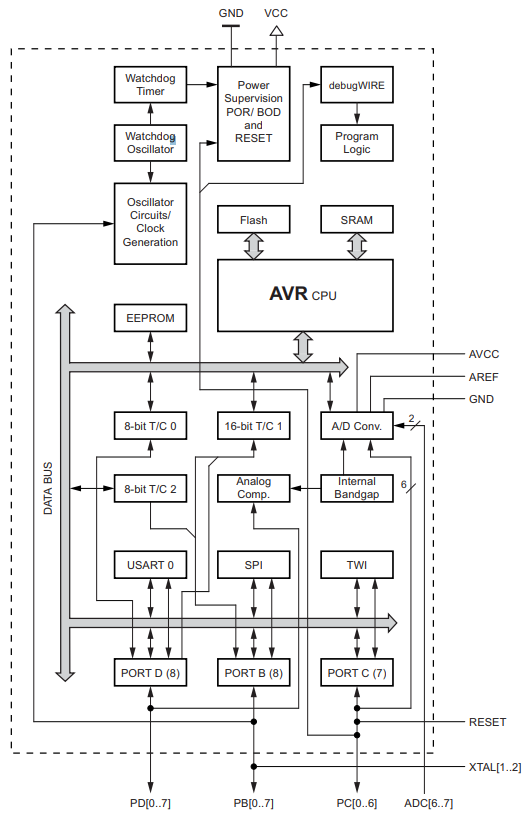
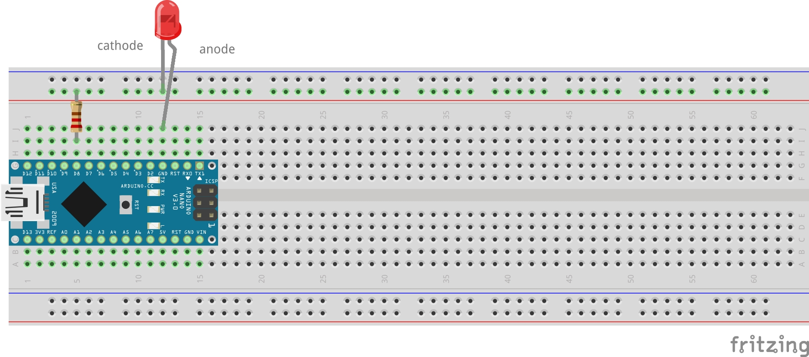

# Input/Output handling
{:toc}

Hopefully, you own and Arduino Nano-compatible board, just like the Cytron's one mentioned in the *Bill of materials* page:

[](https://www.cytron.io/p-maker-nano-simplifying-arduino-for-projects)

> [!IMPORTANT] 
> I strongly support original Arduino to support the the idea behind it! Arduino enabled thousands of people to develop hardware reducing the entry barrier. I strongly encourage to buy yourself one!

The project can be completed using a standard Arduino Nano board if you exclude a buzzer. The Cytron's board adds new features such as LEDs in all GPIO, a programmable button, and a buzzer. It's a nice touch if you want to reduce wiring in your final project.

> [!NOTE] 
> The board uses CH340C as a UART-USB converter. It's may not be compatible with your operating system ot of the box. In *Ubuntu 22.04.3 LTS*, you'll need to configure it by uninstalling a package from your system (it disables braille display): `sudo apt remove brltty` [^1]. MS Windows may require similar steps.

The Cytron's board uses Atmega328P as it's main microcontroller in the TQFP package. Luckily, you don't need to follow PCB paths to determine which board pin correspond to which IC pin. The pinout diagram above does it perfectly! Still, if it happens one day you need create your own PCB, it's worth to know physical dimensions and properties of your microcontroller. You also want make yourself familiar with the original datasheet: [Atmega328P Datasheet](https://ww1.microchip.com/downloads/en/DeviceDoc/Atmel-7810-Automotive-Microcontrollers-ATmega328P_Datasheet.pdf). The datasheet provides all necessary information you need to start coding your IC (integrated circuit) and tech specs that you should follow

## PORTs, PINs and power output

What a port, then? Well, a port in a realm of microcontroller is a module that connects ALU (Arithmetic Logic Unit) with a world by receiving/generating electric signals on a set of pins.
A pin is a physical connector that one can solder onto a PCB. Pins are the true interface that the IC uses to interact with the world

Atmega328p has 3 ports (PORTB, PORTC, PORTD) with built-in pull-up resistors. The 
microcontroller can therefore support up to 23 input/output pins 
(PORTC exposes 7 pins, the rest supports 8 pins). To visualize the overall Atemga architecture,
please refer to the documentation (chapter: 2). The block diagram (extracted from the datasheet *Chapter 2.1 Block diagram*):



That's a theory. You are not soldering your own PCB, you bought an off-the-shelf one. It means, 
you need to map pins defined in Atmega datasheet to your board outputs. Your Cytron's Nano is 
compatible with the original Arduino Nano, therefore you can re-use all resources known in 
Arduino to your advantage. Compare Cytron's pinout (the very first image in this page) with the 
table and the Arduino pinout below.

| PORT | Ardunio Nano | Cytron Maker Nano | Atmega328P |
|------|--------------|-------------------|------------|
| DDRB | D8           | D8                | PB0        |
| DDRB | D9           | D9                | PB1        |
| DDRB | D10          | D10               | PB2        |
| DDRB | D11          | D11               | PB3        |
| DDRB | D12          | D12               | PB4        |
| DDRB | D13          | D13               | PB5        |

[](https://www.electronicshub.org/arduino-nano-pinout/)

`D\d` (for instance: `D8`, `D13`) is an alias for a given pin Arduino ecosystem. You don't need to
memorize anything. Your board has all the markings printed on the PCB solder mask itself. You will use the very same aliases such as `D8`, `D13` in your code if you decide to use Arduino framework. The Atmega328P names correspond to aliases found in Atmega toolchain and are simply a shorthand for underlying pin addresses (i.e., `0x00`). You definitely want to use these aliases for readability.

If you want to know more about Nano board, you can refer to this page [^2].

## Digital output

> [!IMPORTANT] 
> Atmega328p pins are limited to 20mA (milli amps) per pin and up to 100/150mA for 
a port. You should not connect anything more amp-consuming to a port directly. Use a transistor 
to amplify a digital signal to an output that can handle bigger loads. You can read more on 
amplifiers in [Wiki](https://en.wikipedia.org/wiki/Category:Single-stage_transistor_amplifiers). Please, see also *28. Electrical Characteristics* in your Atmega datasheet [^3].

One more thing, Arduino Nano works in 5V logic. It means the high state (also referred as *1*) is 
5V and the low state is 0V (you guessed it! It's referred as *0*). That's the ideal condition, of course. In the real world, *0* state can be considered as 1/3 VDD or lower of your voltage supply. Similarly, the high state is 2/3 VDD or higher [^4]. You can also refer to *28.2 DC Characteristics* in datasheet for more details on input/out (high|low) voltages [^3].

Lots of theory, and no code so far. It's time to change it. Let's take a closer look to the blinking example we had in the previous chapter:

```
// Source: https://github.com/arduino/arduino-examples/blob/main/examples/01.Basics/Blink/Blink.ino

void setup() {
  // initialize digital pin LED_BUILTIN as an output.
  pinMode(LED_BUILTIN, OUTPUT);
}

// the loop function runs over and over again forever
void loop() {
  digitalWrite(LED_BUILTIN, HIGH);  // turn the LED on (HIGH is the voltage level)
  delay(1000);                      // wait for a second
  digitalWrite(LED_BUILTIN, LOW);   // turn the LED off by making the voltage LOW
  delay(1000);                      // wait for a second
}
```

The `setup` function initializes hardware. It includes setting up a desired state on a pin, interrupts, serial devices. Effectively, anything you need to run your main application code in a loop.

The `loop` function is effectively anything you want to run indefinitely as your firmware. This involves all ALU operations you want to run with help of your peripherals such as I/O pins, UART etc.

In order to blink an LED you always need to configure your port by telling a direction of a given pin, whether it's an input or output. Possible options: `OUTPUT`, `INPUT`, `INPUT_PULLUP`.

Once this is done, you can then either write or read a pin state, depending on your direction configuration. To do so, you can use `digitalWrite(<<pin alias>>, <<state>>)` function. *Pin alias* can be a `uint8_t` value or a label such as `LED_BUILTIN`. *State* can be either `LOW` or `HIGH`.

Let's connect your own LED... You need an LED and a resistor. You should never connect an LED to a DC output as you will likely fry it. 


First of all, if you have on experience in electronics you must know that LED is directional.
It means it acts as conductor if connected with correct polarity. If you connect it the other way 
around it won't conduct (well... until it does, briefly :). The term is reverse current and it can be feature sometimes. ). As this is no electric component 101 tutorial, I suggest to take a look at Wiki [^5]. If you are in rush, I recommend taking a look at [voltage-current chart](https://en.wikipedia.org/wiki/File:Forward_and_Reverse_Characteristics_for_diodes-en.svg) to understand how different LEDs can be.

S<sub>1</sub> voltage supply is the Arduino. It gives you 5V. LED requires 0.7V and 0.2mA to
light up. Now, you need to calculate what resistor is needed. The formula uses [Ohm's Law](https://en.wikipedia.org/wiki/Ohm%27s_law) and some [principles on connecting circuits](https://en.wikipedia.org/wiki/Kirchhoff%27s_circuit_laws) in series. I transformed it so it corresponds to the circuit

$$ R_1 = \frac{S_1 - D_1}{I} = \frac{5V - 0.7V}{20 \cdot 10^{-3}A} = 215 \frac{V}{A} = 215\Omega $$

Isn't the physics is electrics amazing? Now, you need to pick a resistor that matches the 
calculations. If you apply lower resistance value, you may fry your LED. I suggest to pick 220Ohm
 resistor or higher. It's all math and diagrams. How to connect it? Well, let's go back to 
 physical world. An LED has two leads: a short one and a longer one. The longer one is the 
 '<strong>+</strong>' (katode) and the shorter one is '<strong>-</strong>' (anode). You want to connect your polarities in series, ie: `V+ - +R- - +D- - -V`. 
 A '-' in component is a plus for the other one. You can also take a look at Adafruit's tutorial 
 for more details [^6]. Oh, and as an interesting fact - the [colors on your resistor](https://en.wikipedia.org/wiki/Electronic_color_code) packaging matter!.

 Please, construct your circuit as proposed here. You can use your jumper cables if you want:
 

 Now, the coding part! It's not that complicated
(source [Incremental blink](./assets/code/chapter_1/1_incremental_blink/)):

```
static constexpr uint8_t HARDWARE_LED = 8;
static constexpr uint8_t DELAY_RATE = 100;
static constexpr uint16_t MAX_DELAY = 3000;

static uint8_t hardwareLedState = HIGH;
static uint8_t hardwareLedDelayCounter = 1;

void setup() {
  pinMode(HARDWARE_LED, OUTPUT);
  digitalWrite(HARDWARE_LED, HIGH); 
}

void loop() {
  uint16_t delayValue = DELAY_RATE * hardwareLedDelayCounter;
  ++hardwareLedDelayCounter;
  if (delayValue > MAX_DELAY) {
    delayValue = DELAY_RATE;
    hardwareLedDelayCounter = 1;
    hardwareLedState = HIGH;
  }

  hardwareLedState ^= 1;
  digitalWrite(HARDWARE_LED, hardwareLedState); 
  delay(delayValue);
}
```

The code increases delay time in each consecutive led state, i.e, 200ms - LOW, 300ms - HIGH and so on. Note a new constant `HARDWARE_LED` - it matches `D8` pin in the Fritzing diagram above.

Ok, so how does it look like in pure AVR then. Well, what Arduino does is really this:

```
int main() {
  setup();
  while(1) {
    loop();
  }
}
```

What Arduino Framework does is really it provides a layer of abstraction over the AVR microcontroller. It's way more developer friendly than dealing with raw registers. Speaking of registers, do you remember the blink example? This is pure AVR code (source: [AVR Blink](./assets/code/chapter_1/2_avr_blink/2_avr_blink.ino)):

```
#include <avr/io.h>
#include <avr/delay.h>

// This is the same hardware LED we introduced earlier!
#define HW_LED (1 << PB0)

int main() {

  /* setup() */
  DDRB = (1 << PB0);
  PORTB = (1 << PB0);  // light up the LED
  /* end: setup() */

  /* loop() */
  while (1) {
    PORTB ^= (1 << PB0);
    _delay_ms(1000);
  }
  /* end: loop() */
}
```

It way more complex, lots of bit shifts and poor readability. You certainly can see `setup()` and `loop()` blocks.

To initialize pin mode (remember: `pinMode()` function?), you need to follow documentation *13.2.3 Switching Between Input and Output* [^3] and set DDRB's value to 1, or precisely `0b0000 0001`. The port shall work as the output device allowing to set/unset state. If you want to connect an LED to `D12` (also known as PB4), you can enable direction by assigning `DDRB = (1 << PB4)` or even `DDRB = 0b0001000`. To enable pin, you need to operate on a different register: PORTB. Operation `^=` means toggling a value under the given bit location. In Arduino, you would call `digitalWrite(pin, LOW|HIGH)` twice.

Clearly, AVR can be much harder to comprehend. So why bother? Well, some day you may be asked to implement a simple firmware on ATtiny13, a microcontroller with very little resources. The AVR example requires 166 bytes, the Arduino one: 924bytes. Any framework shall add additional overhead and consume more flash on your device. You need to be very conscious about resources and the platform limits (i.e., stack depth - nesting functions calls may also lead to errors!).

## Digital input and pull-up resistors

## Interrupts

## Analog input

## Analog output - PWM

Digital electronics, as your Atmega328p, is all about 0 and ones. There are no values in between,
ideally. Thus, it's a rather hard task to talk about analog values in between 0-5V. Luckily, we are not exactly bound to 2 states only. We can change a pin state fast enough to reduce output power in a given timespan - this is called PWM, Pulse
Width Modulation. It's a rather important aspect of embedded programming, therefore
please read the next chapter that handles PWM in details.

There are also Arduino boards that support DAC - Digital-to-Analog converters, such
as [Arduino Due](https://store.arduino.cc/products/arduino-due). Unfortunately,
Atmega 328p, as the one in your board, does not support DAC. For more details,
take a look at Wiki: [Digital-to-analog converter](https://en.wikipedia.org/wiki/Digital-to-analog_converter).


[^1]: [CH340 Configuration in Ubuntu 22.04](https://askubuntu.com/questions/1403705/dev-ttyusb0-not-present-in-ubuntu-22-04)
[^2]: [Electronics Hub - Arduino Nano Pinout](https://www.electronicshub.org/arduino-nano-pinout/)
[^3]: [Atmega328P Datasheet](https://ww1.microchip.com/downloads/en/DeviceDoc/Atmel-7810-Automotive-Microcontrollers-ATmega328P_Datasheet.pdf)
[^4]: [Wiki - Logic Levels](https://en.wikipedia.org/wiki/Logic_level#Logic_voltage_levels)
[^5]: [Wiki - Diode](https://en.wikipedia.org/wiki/Diode)
[^6]: [Adafruit - Connecting LEDs](https://makecode.adafruit.com/learnsystem/pins-tutorial/devices/led-connections)