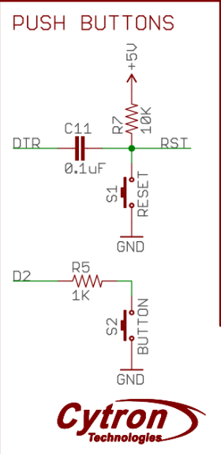

# Input/Output handling

**Contents**
* toc
{:toc}
Hopefully, you own an Arduino Nano-compatible board, just like the Cytron's one mentioned in the *Bill of materials* page:

[](https://www.cytron.io/p-maker-nano-simplifying-arduino-for-projects)

> [!IMPORTANT] 
> I strongly encourage you to support the original Arduino Project and the idea behind it! 
> Arduino enables thousands of people to develop hardware reducing the learning curve.
> I strongly encourage to buy yourself one!

The project can be completed using a standard Arduino Nano board.
 The Cytron's board adds new features such as LEDs in all GPIO, a programmable button, and a buzzer. 
 It's a nice touch if you want to reduce wiring in your final project.

> [!NOTE] 
> The board uses CH340C as a UART-USB converter. It's may not be compatible with your operating system out of the box. 
> In *Ubuntu 22.04.3 LTS*, you'll need to configure it by uninstalling a package from your 
> system (it disables braille display): `sudo apt remove brltty` [^1]. MS Windows may require similar steps.

The Cytron's board uses Atmega328P as it's main microcontroller in the TQFP package. Luckily, you don't need 
to follow PCB paths to determine which board pin correspond to which IC pin. The pinout diagram above does 
it perfectly for you! Still, if it happens one day you need create your own PCB, it's worth to know physical 
dimensions and properties of your microcontroller. You also want make yourself familiar with the original datasheet: 
[Atmega328P Datasheet](https://ww1.microchip.com/downloads/en/DeviceDoc/Atmel-7810-Automotive-Microcontrollers-ATmega328P_Datasheet.pdf). 
The datasheet provides all necessary information you need to start coding your microcontroller 
and tech specs that you should follow.

## PORTs, PINs and power output

What is a port, then? Well, in a realm of microcontroller, a port is a module that connects ALU 
(Arithmetic Logic Unit) with the world by receiving/generating electric signals on its set of pins
(input/output leads).
A pin is a physical connector that one can solder onto a PCB. Pins are the true interface 
that the IC uses to interact with the world.

Atmega328p has 3 ports (PORTB, PORTC, PORTD) with built-in pull-up resistors. The 
microcontroller can therefore support up to 23 input/output pins 
(PORTC exposes 7 pins, the rest supports 8 pins). To visualize the overall Atemga architecture,
please refer to the documentation (chapter: 2). The block diagram (extracted from the datasheet *Chapter 2.1 Block diagram*):


That's a theory. You are not soldering your own PCB, you bought an off-the-shelf one. It means, 
you don't need to map pins defined in Atmega datasheet to your board outputs. Your Cytron's Nano is 
compatible with the original Arduino Nano, therefore you can re-use all resources known in 
Arduino to your advantage. Compare Cytron's pinout (the very first image in this page) with the 
table and the Arduino pinout below.

| PORT | Ardunio Nano | Cytron Maker Nano | Atmega328P |
|------|--------------|-------------------|------------|
| DDRB | D8           | D8                | PB0        |
| DDRB | D9           | D9                | PB1        |
| DDRB | D10          | D10               | PB2        |
| DDRB | D11          | D11               | PB3        |
| DDRB | D12          | D12               | PB4        |
| DDRB | D13          | D13               | PB5        |

[](https://www.electronicshub.org/arduino-nano-pinout/)

`D\d` (for instance: `D8`, `D13`) is an alias for a given pin Arduino ecosystem. You don't need to
memorize anything. Your board has all the markings printed on the PCB solder mask itself. 
You will use the very same aliases such as `D8`, `D13` in your code if you decide to use Arduino framework. 
The Atmega328P pin aliases found in Atmega toolchain and are simply a shorthand for 
underlying pin addresses (i.e., `0x00`). You definitely want to use these aliases for readability.

If you want to know more about Nano board, you can refer to this page [^2].

## Digital output

> [!IMPORTANT] 
> Atmega328p pins are limited to 20mA (milli amps) per pin and up to 100/150mA for 
> a port. You should not connect anything more amp-consuming to a pin directly. Use a transistor 
> to amplify digital signals to an output that can handle bigger loads. You can read more on 
> amplifiers in [Wiki](https://en.wikipedia.org/wiki/Category:Single-stage_transistor_amplifiers). 
> Please, see also *28. Electrical Characteristics* in your Atmega datasheet [^3].

One more thing, Arduino Nano works in 5V logic. It means the high state (also referred as *1*) is 
5V and the low state is 0V (you guessed it! It's referred as *0*). That's the ideal condition, of course.
In the real world, *0* state can be considered as 1/3 VDD or lower of your voltage supply. 
Similarly, the high state is 2/3 VDD or higher [^4]. You can also refer to *28.2 DC Characteristics* 
in datasheet for more details on input/out (high|low) voltages [^3].

Lots of theory, and no code so far. It's time to change it. Let's take a closer look to the 
blinking example we had in the previous chapter:

```
// Source: https://github.com/arduino/arduino-examples/blob/main/examples/01.Basics/Blink/Blink.ino

void setup() {
  // initialize digital pin LED_BUILTIN as an output.
  pinMode(LED_BUILTIN, OUTPUT);
}

// the loop function runs over and over again forever
void loop() {
  digitalWrite(LED_BUILTIN, HIGH);  // turn the LED on (HIGH is the voltage level)
  delay(1000);                      // wait for a second
  digitalWrite(LED_BUILTIN, LOW);   // turn the LED off by making the voltage LOW
  delay(1000);                      // wait for a second
}
```

The `setup()` function initializes hardware. It includes setting up a desired state on a pin,
interrupts, serial devices, etc.. Effectively, anything you need to run your main application code should
be placed within the `loop()`.

The `loop()` function is effectively anything you want to run indefinitely as your firmware. 
This involves all ALU operations you want to run with help of your peripherals such as I/O pins, UART etc.

In order to blink an LED you always need to configure your port by telling a direction of a given pin, 
whether it's input or output. Possible options: `OUTPUT`, `INPUT`, `INPUT_PULLUP`.

Once this is done, you can then either write or read a pin state, depending on your direction configuration. 
To do so, you can use `digitalWrite(<<pin alias>>, <<state>>)` function. 
*Pin alias* can be a `uint8_t` value or a label such as `LED_BUILTIN`. *State* can be either `LOW` or `HIGH`.

Let's connect your own LED... You need an LED and a resistor. You should never connect an LED to a DC output as you will likely fry it. 


First of all, if you have some experience in electronics you must know that LED is directional.
It means it acts as conductor if connected with correct polarity. If you connect it the other way 
around it won't conduct (well... until it does, briefly :)). The term is reverse current and it 
can be a feature sometimes). As this is no electric component 101 tutorial, 
I suggest to take a look at Wiki [^5]. If you are in rush, I recommend taking a look at 
[voltage-current chart](https://en.wikipedia.org/wiki/File:Forward_and_Reverse_Characteristics_for_diodes-en.svg)
 to understand how different LEDs can be.

S<sub>1</sub> voltage supply is the Arduino. It gives you 5V. LED requires 0.7V and 0.2mA to
light up. Now, you need to calculate what resistor is needed. 
The formula uses [Ohm's Law](https://en.wikipedia.org/wiki/Ohm%27s_law) and some 
[principles on connecting circuits](https://en.wikipedia.org/wiki/Kirchhoff%27s_circuit_laws) in series. 
I transformed it so it corresponds to the circuit

$$ R_1 = \frac{S_1 - D_1}{I} = \frac{5V - 0.7V}{20 \cdot 10^{-3}A} = 215 \frac{V}{A} = 215\Omega $$

Isn't the physics of electrics amazing? Now, you need to pick a resistor that matches the 
calculations. If you apply lower resistance value, you may fry your LED. I suggest to pick 220Ohm
resistor or higher. It's all math and diagrams. How to connect it? Well, let's go back to 
physical world. An LED has two leads: a short one and a longer one. The longer one is the 
'<strong>+</strong>' (katode) and the shorter one is '<strong>-</strong>' (anode). 
You want to connect your polarities in series, ie: `V+ - +R- - +D- - -V`. 
A '-' in component is a plus for the other one. You can also take a look at Adafruit's tutorial 
for more details [^6]. Oh, and as an interesting fact - the 
[colors on your resistor](https://en.wikipedia.org/wiki/Electronic_color_code) packaging matter!.

Please, construct your circuit as proposed here. You can use your jumper cables if you want:


Now, the coding part! It's not that complicated
(source [Incremental blink](./assets/code/chapter_1/1_incremental_blink/)):

```
static constexpr uint8_t HARDWARE_LED = 8;
static constexpr uint8_t DELAY_RATE = 100;
static constexpr uint16_t MAX_DELAY = 3000;

static uint8_t hardwareLedState = HIGH;
static uint8_t hardwareLedDelayCounter = 1;

void setup() {
  pinMode(HARDWARE_LED, OUTPUT);
  digitalWrite(HARDWARE_LED, HIGH); 
}

void loop() {
  uint16_t delayValue = DELAY_RATE * hardwareLedDelayCounter;
  ++hardwareLedDelayCounter;
  if (delayValue > MAX_DELAY) {
    delayValue = DELAY_RATE;
    hardwareLedDelayCounter = 1;
    hardwareLedState = HIGH;
  }

  hardwareLedState ^= 1;
  digitalWrite(HARDWARE_LED, hardwareLedState); 
  delay(delayValue);
}
```

The code increases delay time in each consecutive led state, i.e, 200ms - LOW, 
300ms - HIGH and so on. Note a new constant `HARDWARE_LED` - it matches `D8` pin in the Fritzing diagram above.

Ok, so how does it look like in pure AVR then. Well, in AVR context `setup()` and `loop()` functions
translate to this form:

```
int main() {
  setup();
  while(1) {
    loop();
  }
}
```

What Arduino Framework does is really it provides a layer of abstraction over the AVR microcontroller. 
It's way more developer friendly than dealing with raw registers. Speaking of registers, 
do you remember the blink example? This is pure AVR code (source: [AVR Blink](./assets/code/chapter_1/2_avr_blink/2_avr_blink.ino)):

```
#include <avr/io.h>
#include <avr/delay.h>

// This is the same hardware LED we introduced earlier!
#define HW_LED (1 << PB0)

int main() {

  /* setup() */
  DDRB = (1 << PB0);
  PORTB = (1 << PB0);  // light up the LED
  /* end: setup() */

  /* loop() */
  while (1) {
    PORTB ^= (1 << PB0);
    _delay_ms(1000);
  }
  /* end: loop() */
}
```

Isn't it way more complex, is it? Lots of bit shifts and poor readability. 
You certainly can see `setup()` and `loop()` blocks.

To initialize pin mode (remember: `pinMode()` function?), you need to follow documentation 
*13.2.3 Switching Between Input and Output* [^3] and set DDRB's value to 1, or precisely `0b0000 0001`. 
The port shall work as the output device allowing you to set/unset state. If you want to connect an LED to 
`D12` (also known as PB4), you can enable direction by assigning `DDRB = (1 << PB4)` or even `DDRB = 0b0001000`. 
To enable pin, you need to operate on a different register: `PORTB`. Operation `^=` means toggling a 
value under the given bit location. In Arduino, you would need to call `digitalWrite(pin, LOW|HIGH)` twice.

Clearly, AVR can be much harder to comprehend. So why bother? Well, some day you may be asked to 
implement a simple firmware on ATtiny13, a microcontroller with very little resources. 
The AVR example requires 166 bytes, the Arduino one: 924bytes. Any framework shall add additional 
overhead and consume more flash disk space on your device. You need to be very conscious about resources 
and the platform limits (i.e., stack depth - nesting functions calls may also lead to errors!).


## Digital input and pull-up resistors
It's time to get some input events from the world. An obvious choice is a push button. 
A simple device that breaks a circuit if anyone pushes it...

Now, we already know that turning on an LED is to provide state **1**, which translates to 
5V potential at a pin. Good! How about we reverse the order. It'll be you who changes a potential 
on Arduino lead, which translates to a different state on a pin. All you need to do is to verify 
the state in the code!

Some theory is needed. You need to provide stable voltage on your pin. Otherwise, you can read 
any state state between 0 and 1, it'll float. This is why you need to construct a special circuit 
to support a button with a pullup resistor, such as this one:


You are not limited to such a simple design. You can of course connect your button through a 
transitor, i.e., common collector circuit and/or a capacitor to the circuit to eliminate contact 
bounce [^7]. Eliminating contact bouncing can be done 
[programmatically](https://docs.arduino.cc/built-in-examples/digital/Debounce) but it's a rather tedious job to do.

More on pullup resistors can be found on Sparkfun's learning portal [^8] and debouncing here [^9].

Ok, that's all for now. It's a 3h tutorial after all. Let's do some coding. The Cytron board you 
have already has a push button! Let's use it! This is the button schematics (retrieved from 
Cytron's docs):

.

We are interested in the bottom part of the diagram. We can use programmatically `D2` pin. I hope 
you spotted that the button does not support physical debouncing, unfortunately. You can either 
code it on your own, based on the given resources or simply dismiss it. Here's a simple code 
snippet that changes an LED state anytime you press the button and keeps it until you push the 
button again (source - [3_pullup_and_software_debouncing](./assets/code/chapter_1/3_pullup_and_software_debouncing/3_pullup_and_software_debouncing.ino)):

```
static constexpr uint8_t PUSH_BUTTON = 2;
static uint8_t builtinLedState = LOW;

void setup() {
  pinMode(LED_BUILTIN, OUTPUT);
  pinMode(PUSH_BUTTON, INPUT_PULLUP);
  digitalWrite(LED_BUILTIN, builtinLedState);
}

void loop() {
  uint8_t pushButtonState = digitalRead(PUSH_BUTTON);
  if (pushButtonState == LOW) {
    delay(50);                                    // simple programmatic debouncing
                                                  // You should measure the precise debouncing period
                                                  // with an oscilloscope. 50ms is just an educated guess
    pushButtonState = digitalRead(PUSH_BUTTON);

    if (pushButtonState == LOW) {
      builtinLedState ^= 1;                       // toggling the LED state
      digitalWrite(LED_BUILTIN, builtinLedState);

      while (digitalRead(PUSH_BUTTON) == LOW);    // blocking the program until
                                                  // the user releases the button
    }
  }
}
```

Interesting code parts: `pinMode(<<pin>>, INPUT_PULLUP|INPUT)`. This is a pullup configuration for `D2 button`. 
From now on, you can read the state on the `D2` pin!. `digitalRead(<<pin>>)` function reads the state, either `HIGH` or `LOW`.

Another, *weird* part of the code is the nested if-statement and a delay function. Well, this is 
software debouncing. You push the button and connectors start to bounce back and forth. The 
program waits another 50ms until the connectors stabilize. The state should no longer float on 
that pin by the time the program reads the state again. If it is indeed low again, you change the
state of the button.

Note the last `while` loop at the end of the snippet. It blocks the application until the user releases the button.
This is to prevent instant state toggling of the LED. Comment this out and see how your board behaves!

Now, how can you code the same thing in AVR? Let's see (source: [4_pullup_and_software_debouncing_avr](./assets/code/chapter_1/4_pullup_and_software_debouncing_avr/4_pullup_and_software_debouncing_avr.ino)):
```
#define LED_BUILTIN (1 << PB5)
#define PUSH_BUTTON (1 << PD2)

int main() {

  // setup()
  DDRB = LED_BUILTIN;
  DDRD = 0x00;          //set the enitre port as input - including PD2

  PORTB = 0x00;
  PORTD = PUSH_BUTTON;  //PD2 is set as input and the state as HIGH - pullup enabled

  // loop()
  while (true) {

    // the push button is pressed if it's state is 0

      if (bit_is_clear(PIND, PD2)) {  // much clearer than: !(PIND & (1<<PD2))
        _delay_ms(50);
        if (!(PIND & PUSH_BUTTON)) {
          PORTB ^= LED_BUILTIN;
          while (bit_is_clear(PIND, PD2));
        }
      }
  }
}
```

There are some major differences between this code and the Arduino one.
First of all, the state is kept in registers rather than in an application stack. There is also an additional register 
used: `PIND` (see docs: *13.4.10 PIND* [^3]). The register is responsible for reading the state 
on Atmega's lead. It returns all 8 bytes, each byte corresponds to one of the pins in your board. 
To read the state on PD2, you need to run some shifts to get data. Let's decipher this bit, 
assuming you actually keep holding the button:

```
values for:
  PIND = 0b???? ?0?? = 8 (? means state unknown)
  PD2 = 2
  1<<PD2 = 0b0000 0100 = 4

// button is pressed, state on the button lead is 0
1. !(PIND & (1<<PD2))
2. PIND & (1<<PD2)  --> 0b?????0?? & 0b00000100 = 0b00000000 = 0
3. !(0b00000000) = !(0) = !(false) = true  // zero is considered as false in C/C++/python
4. result: true

// button is released, state on the button lead is 1
  PIND = 0b???? ?1?? = 8 (? means state unknown)

1. !(PIND & (1<<PD2))
2. PIND & (1<<PD2)  --> 0b?????1?? & 0b00000100 = 0b00000100 = 8
3. !(0b00000100) = !(8) = !(true) = false // any non-zero number in C/C++/python is always considered as true
4. result: false
```

So really, all this complex math on bytes is all about reading a state on a given lead. If you
decide to use Arduino library, it's way easier to do so! Of course, it all comes with a price.
 This is hex size for each framework:
  * AVR hex size: 184 bytes
  * Arduino hex size: 1086 bytes, more than 1kiB!

Good job! You know how to blink your LEDs both programmatically and with a push button. That's 
quite a lot. Really, interacting with a microcontroller is all about sending and receiving ones 
and zeros. All subsequent chapters only extend that notion! Can you imagine manually pushing and 
releasing a button 1000 times a second? This is what you will learn in the PWM chapter. Well, 
you'll learn how to do it programmatically, at least ;)

Let's move on to the next topic: interrupts. It's not the best idea to run blocking operations 
in the main program loop after all.
 

## Interrupts

Last but not least, we shall take a look at interrupts in this section. What is an interrupt? Well,
it's a mechanism that allows reacting to external (or internal) events outside of the main 
program loop? Wait, what? Let's take a look at an example, this time it'll be AVR code first 
(source - [5_interrupts_avr_toggle_led](./assets/code/chapter_1/5_interrupts_avr_toggle_led/5_interrupts_avr_toggle_led.ino)):

```
#include <avr/io.h>
#include <avr/interrupt.h>
#define LED_BUILTIN (1 << PB5)
#define PUSH_BUTTON (1 << PD2)

ISR(INT0_vect) {                   // magic here: Interrupt Service Routine
  PORTB ^= LED_BUILTIN;
}

static void setup() {
  DDRB = LED_BUILTIN;
  DDRD &= !(PUSH_BUTTON);          // pin as input
  PORTD = PUSH_BUTTON;             // pull-up

  EIMSK = 1 << INT0;               // enable PD2/INT0 as an interrupt source
  EICRA = 1 << ISC01;              // Enable direction of interrupt on INT0, 
                                   // falling edge
}

int main() {
  setup();
  sei();                           // enable global interrupts, SREG register

  while (true) {
    // idle, do nothing
    _delay_ms(10000);
  }
}
```

If you take a closer look at `while (true)` loop, you see it does nothing but sleeping. A good 
nap is nice but this is not why you bought your board to simply let it sleep... You want it to work for you 
and blink an LED!. If you compile it and start pressing the button you see that 
the LED turns on and off. Why? The interrupt!

There are some lines that can be somehow surprising. First of all `sei()` function. It enables 
global interrupts in `SREG` registry as documented in *6.3.1 SREG – AVR Status Register* [^3]. 
It's important not to forget to use it. In my personal experience, forgetting running this 
function is the most common reason why my interrupt routines don't work... it's because I don't 
enable them in the first place... There's also a function that has exactly opposite effect: 
`cli()` - it disables interrupts. It sometimes is handy as well.

Ok, interrupts are enabled. Now, we need to use PB5 (push button) pin as interrupt! Atmega328p offers two I/O 
pins as a source for external interrupts. Not much but still, we need to work with things we 
have*. If you take a look at Arduino pinout from in the top of this page you'll notice that `PB5`
has also `INT0` label. That's the interrupt! Smartly design board, isn't it?

\*you can set up interrupts as *PCIEx* that generates interrupts on many pins but it's out of 
scope of this tutorial

The setup functions sets up the `PB5` as a standard pullup-enabled input pin. There are two 
suspicious registers `EIMSK` and `EICRA`. `EIMSK` allows you to enable `INT0` as an interrupt 
source (vector) - see documentation *12.2.2 EIMSK – External Interrupt Mask Register* [^3]. The 
documentation states you need to set up an activation property to either raising or falling edge. 
You need the falling edge as you use a pullup-resistor. It means the high potential on the lead. 
So anytime you press the button, the potential goes to zero, hence the falling edge.
Of course, you can reverse that logic and use to your advantage. After all, it's all about
making engineering decisions.

Now, the most important part: `ISR()`. ISR is a special macro that handles interrupts in AVR. An 
*average* ISR body should be very concise and efficient. No long running operations as you block 
the main loop! Disabling interrupts and re-enabling them can be also a good idea if your code is 
highly asynchronous. You also should store `SREG` value to make sure you don't disable anything 
by mistake. ISR should then look more like this:

```
volatile uint8_t tmpSREG = 0;

ISR(INT0_vect) {                   // magic here: Interrupt Service Routine
  tmpSREG = SREG;
  cli();
  PORTB ^= LED_BUILTIN;
  SREG = tmpSREG;
}
```

Luckily, Atmega does this operation automatically, so you don't need to specify any `tmpSREG` 
variables [^10]. Hope, you noticed `volatile` keyword. Interrupts modify data outside of a 
regular program loop impacting the value that can be read from such a variable. The keyword 
prevents a compiler from optimizing the variable, improving stability of your application.

So what's an interrupt? A routine that reacts on an external/internal event and runs small 
portions of code called routines outside of a regular program loop. Hope, it's clear now. 
However, can you do the same thing in an easier way? Yes, you guessed it! Let's use Arduino this 
time! So here's the code that does the same thing, with no debouncing (source - 
[5_interrupts_avr_toggle_led](./assets/code/chapter_1/5_interrupts_avr_toggle_led/5_interrupts_avr_toggle_led.ino)):

```
static constexpr uint8_t PUSH_BUTTON = 2;
volatile uint8_t builtinLedState = LOW;


void toggleLed() {
  builtinLedState ^= 1;                       // toggling the LED state
  digitalWrite(LED_BUILTIN, builtinLedState);
}

void setup() {
  pinMode(LED_BUILTIN, OUTPUT);
  pinMode(PUSH_BUTTON, INPUT_PULLUP);
  digitalWrite(LED_BUILTIN, builtinLedState);
  attachInterrupt(                            // enabling interrupts on D2
    digitalPinToInterrupt(PUSH_BUTTON),       // mapping D2 to Atmega's INT0
                                              // this is for readability
    toggleLed,                                // a pointer to function, simply pass
                                              // a name of your function, it's not that scary!
    FALLING);                                 // activate the interrupt on falling edge
}

void loop() {
  delay(10000);
}
```

Hope, the resemblance is obvious... `toggleLed()` function simply performs a toggle operation on 
your built-in LED, using an external state variable. `enableInterrupt` well... enables the 
interrupt in nearly plain English. `digitalPinToInterrupt` maps a pin number to a corresponding 
event source pin, here `INT0`. This is certainly more readable and does not require much of 
knowledge on your board pinout. `toggleLed` here is simply passing a pointer to `toggleLed` 
function. You can use a more explicit way to show it's a pointer: `&toggleLed`, although I find 
it a bit of an overkill. Finally, you need to define a trigger that activates your interrupt. 
Choose FALLING trigger and keep in mind that there other options such as `LOW|CHANGE|RISING` [^11]. 

The `enableInterrupt` function works for digital pins only. Implementing a custom `ISR` can be 
more generic. Atmega328p support 26 input vectors as defined in 
`11.1 Interrupt Vectors in ATmega328P` [^3]. You can also browse `avr/iom328p.h` header to 
get the vector list:

```
[...]
/* Interrupt Vectors */
/* Interrupt Vector 0 is the reset vector. */

#define INT0_vect_num     1
#define INT0_vect         _VECTOR(1)   /* External Interrupt Request 0 */
// [...]
```

To summarize, the interrupts mechanism is a very handy tool if you want to support multiple 
actions in almost the same time. It allows you to act upon any external event and handle it efficiently.

Using interrupts and other Atmega peripherals allows you to implement a solution that appears to 
perform several actions in the same time. Multitasking, my friend :)!


## Analog input and output - ADC and PWM

Digital electronics, as your Atmega328p, is all about zeros and ones. 
There are no values in between, ideally. Thus, it's a rather hard task to talk about analog 
values in between 0-5V. Luckily, we are not exactly bound to 2 states only. We can change a pin 
state fast enough to reduce output power in a given timespan - this is called PWM, *Pulse
Width Modulation*. It's a rather important aspect of embedded programming, therefore
please read the next chapter that handles PWM in details.

There are also Arduino boards that support DAC - Digital-to-Analog converters, such
as [Arduino Due](https://store.arduino.cc/products/arduino-due). Unfortunately,
Atmega 328p microcontroller, as the one in your board, does not support DAC. For more details,
take a look at Wiki: [Digital-to-analog converter](https://en.wikipedia.org/wiki/Digital-to-analog_converter).

You can also read analog values with your microcontroller. Atmega328p comes with a 10-bit ADC and 
comparator built-in! ADC stands for Analog-Digital-Converter, which effectively translates voltage to 
a 10-bit value: 0-1023 integer value. More on ADC in the next chapter!

# References


[^1]: [CH340 Configuration in Ubuntu 22.04](https://askubuntu.com/questions/1403705/dev-ttyusb0-not-present-in-ubuntu-22-04)
[^2]: [Electronics Hub - Arduino Nano Pinout](https://www.electronicshub.org/arduino-nano-pinout/)
[^3]: [Atmega328P Datasheet](https://ww1.microchip.com/downloads/en/DeviceDoc/Atmel-7810-Automotive-Microcontrollers-ATmega328P_Datasheet.pdf)
[^4]: [Wiki - Logic Levels](https://en.wikipedia.org/wiki/Logic_level#Logic_voltage_levels)
[^5]: [Wiki - Diode](https://en.wikipedia.org/wiki/Diode)
[^6]: [Adafruit - Connecting LEDs](https://makecode.adafruit.com/learnsystem/pins-tutorial/devices/led-connections)
[^7]: [Wiki - Contact bounce](https://en.wikipedia.org/wiki/Switch#Contact_bounce)
[^8]: [Sparkfun - Pullup resistors](https://learn.sparkfun.com/tutorials/pull-up-resistors/all)
[^9]: [Physical Computing - Debouncing](https://makeabilitylab.github.io/physcomp/arduino/debouncing.html)
[^10]: [Stack Overflow - May I use cli() and sei() in the interrupt?](https://stackoverflow.com/questions/65112480/may-i-use-cli-and-sei-in-the-interrupt)
[^11]: [Arduino - attachInterrupt](https://www.arduino.cc/reference/en/language/functions/external-interrupts/attachinterrupt/)