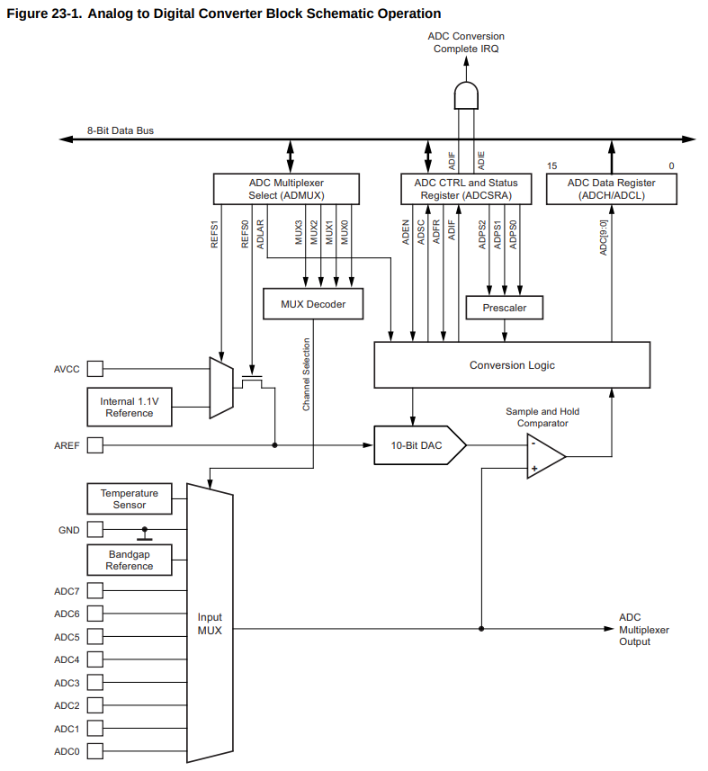
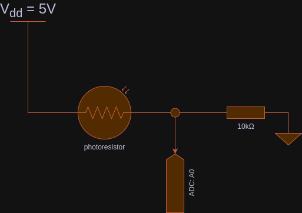
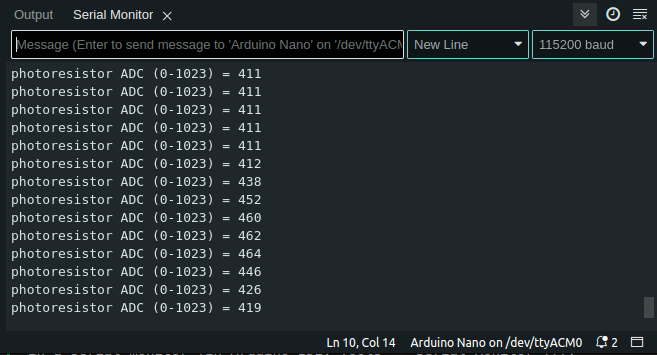
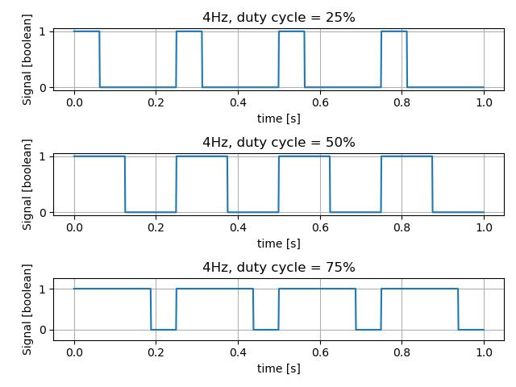

# Analog input, Pulse Width Modulation

**Contents**
* toc
{:toc}
This chapter shall introduce you to a read and write analog inputs/outputs. Digital electronics and 
analog values? Yes, exactly!

## Analog input

Atmega328p comes with a 10-bit Analog-to-Digital-Converter, *ADC* for short. Note the singular form of ADC. There is just one ADC, yet supported in multiple Atmega leads. This can be done by simply
multiplexing the signal. It means the circuit iterates over ADC-ready pins and reads values sequentially, on one pin after another. The diagram represents the circuit design (source [^1]):



You need one more bit to understand basics of ADC. So far we know it's a 10-bit ADC, which means 0-1023 values, and a multiplexer that we need to handle in one way or another. Good, but still we need a reference point, don't we?

You have several options:
* provide your own reference voltage
* use V<sub>cc</sub> as a reference (see `AVCC` in the diagram)
* use built-in 1.1V reference (you can change it with [`analogReference()`](https://www.arduino.cc/reference/en/language/functions/analog-io/analogreference/) function, or setting 
`ADMUX |= (1<<REFS1) | 1<<REFS0)`)

There is also a limit on how fast you can measure the voltage: 10kHz according to [`analogRead()`](https://www.arduino.cc/reference/en/language/functions/analog-io/analogread/) documentation. You can also use ADC as a comparator, which can become handy to implement one of the proposed robot features.

Alright, let's take a look at some code. You need to build a circuit like the one below. All you need is your board, some wires and a photoresistor.



> [!NOTE]
> If you take a closer look at the circuit, you notice it's a [voltage divider](https://en.wikipedia.org/wiki/Voltage_divider)! You can control ADC value at-rest by modifying the resistor value. Try it yourself with 1k, 10k and 100k resistors.

And you can use the following Arduino code (source - [Analog Read with Serial Monitor](./assets/code/chapter_2/2_analog_read_serial_monitor/2_analog_read_serial_monitor.ino)):
```
static constexpr const uint8_t ANALOG_PIN_PHOTORESISTOR = A0; 

static uint16_t photoresistorValue = 0;

void setup() {
  Serial.begin(115200);
  while (!Serial);
}

void loop() {
  photoresistorValue = analogRead(ANALOG_PIN_PHOTORESISTOR);

  Serial.print("photoresistor ADC (0-1023) = ");
  Serial.println(photoresistorValue);

  delay(50);
}

```

Let's dismiss explanation for `Serial` prefixed calls. It's UART and shall be formally introduced in the next chapter. All you need to know about it is UART can transfer data onto your PC and display it in a serial monitor (in Arduino IDE: Tools -> Serial Monitor, make sure `baud` is set to **115200**):



Use your flashlight or a phone LED to shed a beam of light onto the photoresistor. You'll see how the 
values change. By default, if no light reaches the photoresistor, it's effectively a break in a 
circuit, which translate to high resistance (think megaohms). On the other hand, the brighter the 
area, the less resistance can be observed.

From the code perspective, Arduino offers a function called `analogRead(<<ANALOG PIN>>)`. It returns a value between 0-1023, that corresponds to 0-5V in real world. It's up to you, how you map it. You can, obviously, use a function `map()` to map things. Say you want convert ADC value into a PWM value 0-1023 -> 0-255, you can type `uint8_t result = map(0, 1023, 0, 255, <<adc value>>);`

Note the `delay` at the end of processing. It's linked with how multiplexer really works. It takes 
time to iterate over each analog pin. Still, `analogRead()` is pretty good if you simply want to get 
an analog value quickly.

How would Atmega code look like? Well, it's more complicated than one simply function call (source [Analog Read - Registers](./assets/code/chapter_2/2_2_analog_read_atmega_registers_adc0/2_2_analog_read_atmega_registers_adc0.ino)):

```
static uint16_t photoresistorValue = 0;

void setup() {
  Serial.begin(115200);
  while (!Serial);
  
  ADCSRA = (1 << ADEN)  // enable ADC
    | ((1 << ADPS2) 
    | (1 << ADPS1) 
    | (1 << ADPS0));     // prescaler 128
  ADMUX = (1 << REFS0); // MUX3..0 bits are set to 0, which is ADC0/PC0/A0 pin
}

void loop() {  
  ADCSRA |= (1 << ADSC);            // start ADC convertion
  while (!(ADCSRA & (1 << ADIF)));  // wait until ADC completes its job
  photoresistorValue = ADC;         // provide ADC value present on A0 pin

  Serial.print("photoresistor ADC (0-1023) = ");
  Serial.println(photoresistorValue);

  delay(50);
}
```

There are 3 registers you need play with (see *23.9 Register Description* [^1]):
* `ADCSRA` - ADC Control and Status register, enables/disables ADC, triggers a conversion and sets up basic parameters
* `ADMUX` - ADC Multiplexer Selection Registers - allows choosing a given channel in an ADC multiplexer
* `ADC` - combined result of `ADCH` (high register) and `ADCL` (low register) in 16bit variable - expect 10-bit value

So the first step is to enable ADC hardware and set up a prescaler to reduce MUX processing speed 
(16MHz, default clock in your board) by dividing it by 128, so the hardware can really measure a 
value. Then, you choose a channel from which you intend to read. Finally, you perform a blocking wait 
`while (!(ADCSRA & (1 << ADIF)))` until the channel is ready to provide an analog value measured on a pin.

Of course, if you remember your interrupt tutorial, you can use it here as well. You need to implement an `ISR(ADC_vect)` and start ADC in an interrupt mode by enabling `ADCSRA |= 1 << ADIE` bit. Of course, you cannot forget about enabling global interrupts `sei()` (source - [Analog Read with Interrupt](./assets/code/chapter_2/2_3_analog_read_atmega_interrupts/2_3_analog_read_atmega_interrupts.ino)):

```
volatile uint16_t photoresistorValue = 0;

void setup() {
  Serial.begin(115200);
  while (!Serial);
  
  ADCSRA = (1 << ADEN)  // enable ADC
    | ((1 << ADPS2) 
    | (1 << ADPS1) 
    | (1 << ADPS0))     // prescaler 128
    | (1 << ADIE);      // enable interrupts

  ADMUX = (1 << REFS0); // MUX3..0 bits are set to 0, which is ADC0/PC0/A0 pin
  ADCSRA |= 1 << ADSC;  // start ADC, handle a response in the ISR routine
  sei();
}

void loop() {  
  Serial.print("photoresistor ADC (0-1023) = ");
  Serial.println(photoresistorValue);

  delay(50);
}

ISR(ADC_vect) {
  photoresistorValue = ADC;
  ADCSRA |= 1 << ADSC;      // run ADC/ch:adc0 immediately again
}
```

I suggest you to review documentation in details if you need to provide accurate measurements. For the sake of this tutorial, a coarse value is enough. The documentation introduces you to things such as ADC Noise canceller and available techniques, ADC accuracy and measurement errors etc.

## Analog output - PWM

Let's face it, you cannot have an analog output without a [DAC (Digital to Analog Converter)](https://en.wikipedia.org/wiki/Digital-to-analog_converter)... You can get a really good approximation, though!

There are a few ways you can think about it. Say you want your LED emit light at half of it's 
luminosity. Naturally, you may want to run an LED at half of your voltage, say 1.5V. You can construct 
a voltage divider to get 1.5V. It's far from ideal if you want to dynamically control a brightness of 
your LED or control a electric motor. In a case of the electric motor, your circuit would dissipate 
lots of energy on simply making sure you reach desire voltage.

So what can we do? Well, you can turn off and on your 5V signal very fast. So fast that you won't even 
notice that LED is off or motor is not supplied with power. How fast, well - it depends. For an LED 
25Hz should be enough if you recall old school TVs. You don't really see images changing. For DC 
motors, I'd say anything above 20kHz so you don't hear anything ([20kHZ is a max frequency a human ear can hear](https://en.wikipedia.org/wiki/Hearing_range)).

If you measure voltage of a quick voltage toggling, you'll see a square-like signal, a square wave.
You achieve it by simply turning on and off the pin. Say, you want your LED emit light for 0.1 second 
and rest for 0.9s. Then, repeat! Congratulations, that's all about PWM! If your period takes one 
second to implement and the LED is active only for 10% of that time, it is 10% duty cycle. Duty cycle 
is a period in which your effector performs work, in this case - it emits light.

Take a look at this diagram to fully understand how it works:

.

The diagram presents different duty cycle at 4Hz frequency (or 0.25s period). 25% duty cycle means the 
signal is active only for 1/4 of time time period. Similarly, 50% duty cycle, means it's active for 
half the time period. If you run your duty cycle at 100%, effectively you turned your signal into a 
turn on/off switch.

The amplitude is of course V<sub>cc</sub>=5V. So on average, 25% of 5V gives 1.25V. There is also a more fancy formula to compute it:

$$  x_{avg} = \frac{1}{T} \int_{t_0}^{t_0+T} u(t)^2 \,dt $$

If you run the integral against the square waveform function, you'll get a simple equation, in Volts:

$$ U_{avg} = d \cdot U_{max.amplitude} $$

where `d` is duty cycle i.e., `d=0.25` for 25% duty cycle.

I almost forgot... The phenomenon is called **Pulse Width Modulation** (PWM in short). Hopefully, you see
why. Take a look at the diagram - duty cycle is represented by width. More the width, greater the average signal/power/voltage/anything, the wider is the pulse.

Now, let's implement a naive PWM example, by hand (source [PWM - Naive implementation](./assets/code/chapter_2/2_4_naive_pwm/2_4_naive_pwm.ino)).

```
static constexpr const uint8_t DUTY_CYCLE = 10;

static constexpr const int PERIOD_MS = 10;                              // 1/0.01s = 100Hz
static constexpr const int ON_PERIOD_MS = PERIOD_MS * DUTY_CYCLE / 100; // round
static constexpr const int OFF_PERIOD_MS = PERIOD_MS - ON_PERIOD_MS;

static constexpr const uint8_t LED_PIN = LED_BUILTIN;


void setup() {
  pinMode(LED_PIN, OUTPUT);
}

void loop() {
  digitalWrite(LED_PIN, HIGH);  
  delay(ON_PERIOD_MS);  

  digitalWrite(LED_PIN, LOW);   
  delay(OFF_PERIOD_MS);                      
}
```

Go and play with it, modify `DUTY_CYCLE` to 10, 20, 30... and so on. Observe your LED (the built one, or any other you are willing to connect). You can see that LED has different brightness depending on the value.

The `loop()` portion simply turns on and off the LED. In the given example, PWM works at roughly 100Hz and duty cycle of 10%. Your LED should be very dim. It's roughly 100Hz because it takes some CPU cycles to call each function `digitalWrite`, `delay`. Still, it's a good 100Hz approximation. You can do better though! Keep reading!

PWM is so common that probably all microcontrollers available on the market provide hardware support for PWM. 
Arduino Nano/Atmega328p is no different! Let's translate the code to more Arduino friendly form 
(source: [Arduino - analogWrite](./assets/code/chapter_2/2_5_arduino_analogWrite/2_5_arduino_analogWrite.ino)). Make sure you connect your own LED to PIN 6, or simply use one that
 comes with your Cytron's board:

```
static constexpr const uint8_t DUTY_CYCLE = 10;  // 10% duty cycle
static constexpr const uint8_t LED_PIN = 6;      // PWM-ready pins: 3, 5, 6, 9, 10, 11

static constexpr const uint8_t PWM_VALUE = UINT8_MAX * DUTY_CYCLE / 100;

void setup() {
  pinMode(LED_PIN, OUTPUT);
  analogWrite(LED_PIN, PWM_VALUE);
}

void loop() {
  // nothing to do             
}
```

You can clearly see a new function here: `analogWrite(<<pin>>, <<pwm value, 0..255>>)` [^2]. The 
function uses hardware PWM module to generate a square wave signal at roughly 500Hz or ~1kHz, 
depending on pin you want to use. You can either refer to Arduino documentation or simply take a look 
at your board to see which pins support PWM (usually marked with `~` character).

It should be enough for most of your LED-cases. What if you want to use other frequencies? Atmega comes with a set of **timers**: 8-bit and 16-bit timers that let you customize your PWM pin (or count signals etc.). See *14. 8-bit Timer/Counter0 with PWM* and *17. 8-bit Timer/Counter2 with PWM and Asynchronous Operation* for more details on 8-bit timers [^1].

Let's say you want to run your PWM at exactly 50Hz... Things get trickier, don't they? Well, for such 
a use case we need to address some of the Atmega registers and the 16-bit timer! See *15. 16-bit Timer/Counter1 with PWM* for more details [^1].

There are two Arduino pins that support the 16-bit timer: `PB1/D9` and `PB2/D10`, also known `OC1A` 
and `OC1B` correspondingly. Connect your LED to to `PB1/D9`. Remember about a resistor (at least 220Ohm)! Source - [Arduino - Phase Correct PWM](./assets/code/chapter_2/2_6_pwm_phase_correct/2_6_pwm_phase_correct.ino):

```
static constexpr const uint8_t DUTY_CYCLE = 10;  // 10% duty cycle

void setup() {
  DDRB |= (1<<PB1); // Set PB1 as output
  /*
      Enable PWM on PIN PB1/Arduin D9

      CPU CLK, fclk_I/O = 16,000,000
      Timer: Phase Correct PWM, see 15.9.4 Phase Correct PWM Mode in Datasheet
      Formula: fOCnxPCPWM = fclk_I/O / {2* N * TOP}
      fOCnxPCPWM=50Hz
      Prescaler: N=8
      TOP = fclk_I/O / {2 * N * fOCnxPCPWM}

      TOP=ICR1=20000
  */
  TCCR1A = (1<<COM1A1)   // PB1 as PWM, see the pinout
      | (1<<WGM11);      // phase correct PWM, TOP=ICR1
  TCCR1B = (1 << WGM13) 
      | (1 << CS11);     // prescaler 8
  ICR1 = 20000;

  OCR1A = ICR1 * DUTY_CYCLE / 100;  // PWM values are in range 0..ICR1
}

void loop() {
  // nothing to do
}
```

Wait, what? Exactly! Some math, bit shifts and dark magic... Yes, I know the feeling. That's why I use 
Arduino libs if I don't need to handle any specific use cases.

First of all, 16-bit timer comes with several available modes: Normal Mode, CTC (Clear Timer on Compare
match), Fast PWM, Phase Correct PWM, Phase and Frequency Correct PWM. Make yourself familiar with the documentation in chapter *15. 16-bit Timer/Counter1 with PWM* [^1].

I chose the Phase Correct PWM (see *15.9.4 Phase Correct PWM Mode* [^1]) because this particular mode
is a good choice for motors, quote:

> "However, due to the symmetric feature of the dual-slope PWM modes, these modes are preferred for
> motor control applications."

To set up precisely 50Hz, you need to follow the formula:

$$ f_{OCnxPCPWM} = \frac {f_{clk_I/O}} {2 \cdot N \cdot TOP} $$

where *f<sub>OCnxPCPWM</sub>* is frequency in Hz, *N* - prescaler, and TOP either ICR1 (Input Capture Register) or OCR1A/OCR1B (Output Capture Register), depending on your timer configuration.

By default, Arduino boards work at 16MHz frequency, which is 16,000,000Hz. Let's transform the formula:

$$ TOP = \frac {f_{clk_I/O}} {2 \cdot N \cdot f_{OCnxPCPWM}} = \frac {16000000} {2 \cdot 8 \cdot 50} = 20000 $$

There is no one good answer to these parameters... You can apply a different prescaler i.e. `N=64`, which results in `TOP=2500`. The resolution of a timer is a bit narrower. That can still be perfectly fine with your use case. It's up to you, freedom!

Please, compare the code snippet with the table *Table 15-5. Waveform Generation Mode Bit Description(1)* [^1]. 
I chose a timer #10 that clears on ICR1, which means no "internal counter increments" for the timer. 
The hardware goes from BOTTOM to TOP/ICR1 and then back from TOP/ICR1 to BOTTOM. I am more interested 
in changing duty cycle rather than the frequency. If you want to generate sounds, you might as well 
choose timer #11, and keep duty cycle constant (so your music stays at the same level). Yet another 
engineering decision.

Ok, so we have prescaler N=8, which translates to `TCCR1B |= (1 << CS11)` (see table *Table 15-6. Clock Select Bit Description* [^1]), and `ICR1=20000`. To set up the Phase Correct PWM, you need to modify two registers: `TCCR1A |= 1 << WGM11` and `TCCR1B |= 1<< WGM13`. Finally, you want to 
enable PWM on the PB1 pin, here also known as `COM1A1` by setting bit `TCCR1A |= 1 << COM1A1` (see 
table *Table 15-4. Compare Output Mode, Phase Correct and Phase and Frequency Correct PWM(1)*). Don't
forget about the direction registry `DDRB |= (1<<PB1)`.

Finally, you want to set duty cycle. Remember, `ICR1` is your max value, you simply compute your 10% duty cycle `OCR1A = ICR1 * DUTY_CYCLE / 100`.

Yes, we're done with it! Congratulations!

You probably have a question: why 50Hz? Well, that's a secret! Check the servo control chapter ;)!

Going back to the theory. PWM does not provide voltage control. It can only control the overall power 
output but still within zeros and ones. If you inspect your circuit to an oscilloscope, you'll see a 
pretty nice square waveform. It's nothing like a flatline with a steady voltage. If this is really 
what you want to achieve, you can implement an RC circuit or even RLC one [^3][^4]. You need to be 
familiar with analog electronics, which is magic in itself. The easiest way both money and time wise 
is to buy an external DAC converter such as this one [MCP4725](https://github.com/adafruit/Adafruit_MCP4725?tab=readme-ov-file).

# References

[^1]: [Atmega328P Datasheet](https://ww1.microchip.com/downloads/en/DeviceDoc/Atmel-7810-Automotive-Microcontrollers-ATmega328P_Datasheet.pdf)
[^2]: [analogWrite() documentation](https://www.arduino.cc/reference/en/language/functions/analog-io/analogwrite/)
[^3]: [Low-Pass Filter a PWM Signal into an Analog Voltage](https://www.allaboutcircuits.com/technical-articles/low-pass-filter-a-pwm-signal-into-an-analog-voltage/)
[^4]: [Digital-to-Analog Conversion](https://thingsdaq.org/2022/02/02/digital-to-analog-conversion/>)