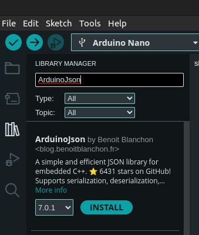
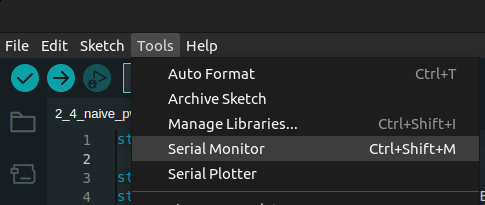
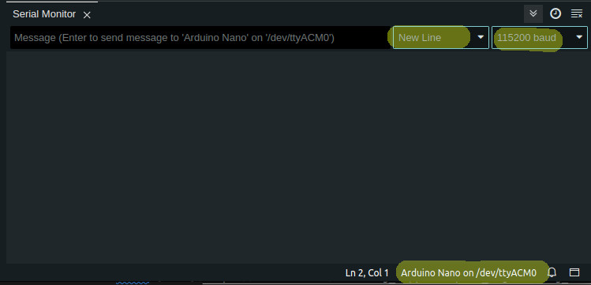
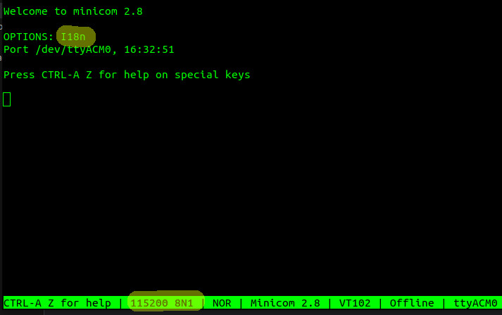
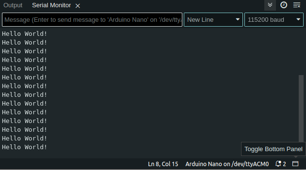
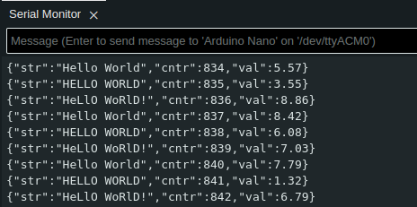
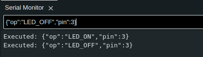

# Universal Asynchronous Receiver-Transmitter
**Contents**
* toc
{:toc}
So far, you've been blinking LEDs in one way or another. It's time to let your board talk to your PC too!.

See *19. USART0* chapter in Atmega328p Datasheet for very detailed UART tech specification [^1].

## Introduction

Serial port, [UART](https://en.wikipedia.org/wiki/Universal_asynchronous_receiver-transmitter) or 
[Universal Asynchronous Receiver-Transmitter](https://en.wikipedia.org/wiki/Universal_asynchronous_receiver-transmitter)
 is a way that allows you to connect easily your device with PC and exchange data.

Asynchronous means that receiver/transmitter does not have to run at the same pace. Clocks of both devices can run at different frequencies or be out of phase. UART uses start and stop bits to 
determine when the transmission is over. This gives a great advantage. The protocol can work with no 
difficult clock synchronization techniques and technologies. 
Therefore, UART can be used at longer distances, speaking more of meters (yards) rather than 
centimeters (inches).

There are two industry wide standards of UART: [RS-232](https://en.wikipedia.org/wiki/RS-232) 
and [RS-485](https://en.wikipedia.org/wiki/RS-485). We are going to use 2 other cases: TTL 
(Transistor-to-Transistor Logic) and connection via UART-USB bridge. In other words, you'll use Atmega integrated circuit, connect it to a 3rd party silicone chip (such as CH340, PL2303, FT232RL and many other) and plug a USB connector to your PC. You can even use another 
Atmega to host a USB (for instance Atmega16u4 with hardware USB support [^2])

Good news is your Arduino board (either Cytron's or the genuine one) comes with UART-USB converter. From coding perspective, you don't need to do anything.

A traditional UART tutorial presents and explains a data frame - a sequence of bits that form a single portion of a message... Let's get it over now (image source: [Wiki - by Cody Hyman](https://pl.wikipedia.org/wiki/Plik:Serial_frame.png)):


Isn't it nice? Well, let me explain it from a perspective of typical parameters one typically uses:

* [baudrate](https://en.wikipedia.org/wiki/Baud) (popular: 9600, 115200) - originally, baud rate is a number of symbols/pulses emitted in a unit of time. In context of UART communication, think `baudrate=bitrate=bits per second` [^3]. Good enough, we are not purists here. And one more thing, the bigger the number, the faster is data transmission.
* dataframe (popular choice: 8 bits, 7-9 possible) - simply how many data bits shall be placed between the start bit and parity/end bits
* parity (set to no-parity) - a checksum bit, you can use it or simply ignore it. I prefer to ignore it. Other options are even and odd parity
* stop bits (popular choice: one; other options: one and a half, two bits)
* flow control (Arduino choice: No Flow Control) - UART supports two leads: RTS (Request to Send) and CTS (Clear to Send). Arduino uses TX and RX pins only, so there is no need to bother.

For a more detailed explanation, please refer to external sources such as this one: [UART - A hardware communication protocol](https://www.analog.com/en/analog-dialogue/articles/uart-a-hardware-communication-protocol.html) and other.

If you are going to connect your UART device to another device, make sure that:
* Baudrate must be the same for both a receiver and a transmitter
* Voltage levels are acceptable - 5V-5V in both devices. Your device uses 5V as it's V<sub>cc</sub> voltage. If you connect to a device that uses 3.3V, you'll likely fry it. Hence, a [logic level converters/level shifter](https://en.wikipedia.org/wiki/Level_shifter) should be introduced.
* Cross your comm lines: `TX` (transmit line) should be connected to `RX` (receive line)
* NEVER FORGET ABOUT THE GROUND!!! GROUND IT!!! Actually, `GND` line should be the first line you connect and the first line you check if something is wrong. Seriously, you'll save lots of time by following this tip!

`TX1` pin is your transmitter and `RX0` is the receiver in your board. Take a look at it. Of course, you can simply use a USB cable if you plan to use PC comm only.

### Serial Monitors

You can use your serial device with a 3rd party tool or your custom software. If you decide to simply
browse or even plot data you can use some of these tools.

Windows:
  * [GUI] Arduino IDE - embedded serial monitor
  * [GUI] PlatformIO - embedded serial monitor
  * [GUI] [PuTTY](https://www.putty.org/)
  * [CLI] [Tabby](https://tabby.sh/)

Linux:
  * [GUI] Arduino IDE - embedded serial monitor
  * [GUI] PlatformIO - embedded serial monitor
  * [CLI] [minicom](https://en.wikipedia.org/wiki/Minicom)
  * [CLI] [Tabby](https://tabby.sh/)

If you are interested in writing your own software, you need a library or [follow a Lord's blessed path](https://en.wikipedia.org/wiki/TempleOS) and write your own library. It's up to you. Personally, I worked with the following:

* C++: 
  * Qt Framework, [Qt Serial Port](https://doc.qt.io/qt-6/qtserialport-index.html)
  * Boost Asio, [Serial Port](https://beta.boost.org/doc/libs/1_66_0/doc/html/boost_asio/reference/serial_port.html)
* python: [pyserial](https://pyserial.readthedocs.io/en/latest/pyserial.html)
* Java: [jSerialComm](https://fazecast.github.io/jSerialComm/)

## SerDes - Serialization and Deserialization

Data *serialization* is a process of converting data into a format that can be transmitted over 
wire/air and decoded at a destination point. The reverse process is called *deserialization*.

The keyword is **format**. You can choose two options: text or binary. The text option is usually human readable, supported by formats such as CSV, JSON, HTML, anything custom. The binary format 
converts data into a series of bytes, sometimes applying compression. You need to use the same 
serialization/deserialization technique in both receiver and transmitter to successfully deliver a 
message. Otherwise, this can be random bytes.

Which one is better? Well, it depends. The binary format usually comes with big frameworks that can 
convert a *schema* into your C or C++ code. All you need to do is to compile a schema file and link 
generated files to your program. IMO, the greatest disadvantage of the binary format is difficulty to 
handle data packets. Since all your data is binary, you don't really know when the message stops and 
another message begins. A byte of binary data is really an 8-bit number, which translates to 0-255(dec). Microcontroller is not aware of what the byte means. The binary formats of your choice usually 
provides libraries to capture a whole message and deserialize it, such as 
[protobuf](https://github.com/protocolbuffers/protobuf) or [msgpack](https://msgpack.org/), [ROS Messages](https://wiki.ros.org/Messages). Of course, you can implement something custom too - see the note below.

You can use text format too! It has several advantages: 1) it's human readable, 2) easy to find the last character, usually a new line character `\n`. Text format narrows down a range of values we send 
in a single byte from the binary data perspective. [ASCII](https://pl.wikipedia.org/wiki/ASCII) encodes human readable numbers as characters starting from a value 32 (in decimal, space ` `) up until 126 (dec, `~` character). Numbers between 0-31 and 127 
are special characters, such as *new line* character `\n` 10 (decimal). Thanks to this trick, a 
microcontroller can listen and cache raw bytes incoming from another UART device until it 
receives a byte of value 10 (dec, a new line character). You received a full line, a message that can be processed!

> [!NOTE]
> Long time ago, I was playing with robotics and European Rover Challenge. We didn't know anything
> about electronics and coding back then. We needed to control a robotic arm with 8 effectors. We 
> developed a binary format -> one byte to control all 8 devices: AAAV VVVV. `AAA` - 3 address bits, 
> `VVVVV` - a value between 0-31. This technique allowed us to control a 6-DOF arm without really any 
> worries about a data package start and stop positions. All we needed to do was to read just one byte 
> to rule it all :)!

In my experience, hobby projects work very nicely with JSON (text) encoding. Simply, read a line of 
text data and deserialize JSON into individual variables. I recommend ArduinoJson[^4].

ArduinoJson deserialization example (source: [JsonParserExample](https://github.com/bblanchon/ArduinoJson/blob/7.x/examples/JsonParserExample/JsonParserExample.ino))

```
// ArduinoJson - https://arduinojson.org
// Copyright © 2014-2024, Benoit BLANCHON
// MIT License
//
// This example shows how to deserialize a JSON document with ArduinoJson.
//
// https://arduinojson.org/v7/example/parser/

#include <ArduinoJson.h>

void setup() {
  // Initialize serial port
  Serial.begin(9600);
  while (!Serial)
    continue;

  // Allocate the JSON document
  JsonDocument doc;

  // JSON input string.
  const char* json =
      "{\"sensor\":\"gps\",\"time\":1351824120,\"data\":[48.756080,2.302038]}";

  // Deserialize the JSON document
  DeserializationError error = deserializeJson(doc, json);

  // Test if parsing succeeds
  if (error) {
    Serial.print(F("deserializeJson() failed: "));
    Serial.println(error.f_str());
    return;
  }

  // Fetch the values
  //
  // Most of the time, you can rely on the implicit casts.
  // In other case, you can do doc["time"].as<long>();
  const char* sensor = doc["sensor"];
  long time = doc["time"];
  double latitude = doc["data"][0];
  double longitude = doc["data"][1];

  // Print the values
  Serial.println(sensor);
  Serial.println(time);
  Serial.println(latitude, 6);
  Serial.println(longitude, 6);
}

void loop() {
  // not used in this example
}
```

ArduinoJson will be used by default in subsequent chapters. Make sure to install it! Go to `Tools -> Manage Libraries...`, type `ArduinoJson` and click *Install*:




## Arduino Framework

Arduino allows you using serial communication with ease. Make sure you familiarize yourself with documentation[^5].

### Serial initialization

This section shall present you how to write data to your PC. To connect with your microcontroller,
you can use Arduino Serial Monitor, PlatformIO Serial Monitor, minicom or really anything you
enjoy. The following examples shall use Ardunio Serial Monitor and minicom interchangeably.

Go to `Tools -> Serial Monitor`:



You'll see a new section at the bottom of your window. Make sure baudrate, newline setting and USB port are selected as shown in the picture (if you use Windows, port can be something like `COM7`):



To start `minicom`, enter the following:

```
$ minicom -b 115200 -D /dev/ttyACM0
```

Minicom opens with `baudrate=115200`, 8-bits dataframe, 1 stop bit, no parity. Just like the Arduino Serial Monitor and the default Arduino Serial config (`SERIAL_8N1`)



You know how to open a serial monitor, now it's worth knowing how to start UART communication in Arduino.

There are two steps:

1. Initialize serial with baudrate and other config
1. Wait until a serial peripheral module starts (busy waiting)

Let's see some code (source - [Arduino Serial Initialize](./assets/code/chapter_3/arduino_serial_initialize/arduino_serial_initialize.ino)):

```
void setup() {
  Serial.begin(115200);
  while(!Serial) continue;
}

void loop() {
}
```

That's it! Isn't it simple? You probably have a feeling that these two lines hide some complex
register calls. That's correct! Let's now just focus on the positives: it takes two lines to enable Serial.

`Serial.begin(<<baudrate>>[, <<config, default: SERIAL_8N1>>])`[^6] initializes serial port to 
a given baudrate. Optionally, you can specify additional config for serial, should you need it. Otherwise, just enjoy simplicity of the API. Note that `Serial` is effectively a global variable 
that represents hardware serial. If you own an Arduino Mega, Due or any other that happend to support multiple UARTs, you can use other ports as well: `Serial1`, `Serial2`. You just need to make sure you connect necessary cables accordingly.

`while (!Serial) continue;` performs a busy waiting operation. The application waits here until the serial is initiated successfully. The implementation of `Serial` provides an overloaded `operator bool()`[^7]. 

Alright, we are ready to finally send some data to PC!

### Write data
#### Write a simple line

Without further edo, this is the code (source: [Arduino - UART Hello World](./assets/code/chapter_3/arduino_serial_hello_world/arduino_serial_hello_world.ino)):

```
void setup() {
  Serial.begin(115200);
  while(!Serial) continue;
}

void loop() {
  Serial.println("Hello World!");
  delay(1000);
}
```

To write a line, simply use `Serial.println()` function[^8]. It accepts raw strings such as `char *` and 
provides an overload for typical data types, such as `int`. 



If you want to send an `int`, you can also
choose to print it either as decimal, octal or hexadecimal value, i.e.:

```
  Serial.println(15, DEC);
  Serial.println(15, BIN);
  Serial.println(15, OCT);
  Serial.println(15, HEX);

  result:
    15
    1111
    17
    F
```

Of course, there is also a function that does not add new line characters: `\r\n`. You can use [`Serial.print`](https://www.arduino.cc/reference/en/language/functions/communication/serial/print/).

Both `print()/println()` functions send data in a text format. Well, at least this is how data should
be interpreted at a receiving end. You can also send binary data with `Serial::write` function[^9]. As 
this course uses text-based serialization, I'll leave the binary part to study on your own. You can 
make it!


#### Write a line, substitute placeholders

Printing a static text is nice, but this is not how you use programs. You put data in and expect some results returned. How to send variable data? There are several options:
* Combine `print` and `println` into a sequence of calls
* Create a buffer string and generate a custom string
* Use a custom serializer: ArduinoJson or anything else
* Go with some sort of binary serialization and libraries

In this section, we'll try to go with the second approach (source - [Arduino - Buffer and sprintf](./assets/code/chapter_3/arduino_serial_buffer_sprintf/arduino_serial_buffer_sprintf.ino)):

```
#include <string.h>

static const constexpr uint8_t TXT_BUFFER_SIZE {64};
static char const TXT_BUFFER[TXT_BUFFER_SIZE] {'\0'};

static int counter {0};

static const char *HELLO_WORLD_LABELS[] = {
  "Hello World",
  "HELLO WORLD",
  "HeLlO WoRlD!"
};

void setup() {
  Serial.begin(115200);
  while(!Serial) continue;
  randomSeed(analogRead(0));
}

void loop() {
  uint16_t value = random(1000);                    // generate a random number
  char random_char = map(value, 0, 1000, 32, 127);  // random visible ASCII character
  ++counter;

  sprintf(TXT_BUFFER, "%s #%d: value=%d, char=%c",  // define a string and substitutions
    HELLO_WORLD_LABELS[counter%3],                  // substitute %s with a random string
    counter,                                        // substitute first %d with the counter
    value,                                          // substitute second %d with a random number
    random_char);                                   // substitute %c with a character

  Serial.println(TXT_BUFFER);
  delay(1000);
}
```

There are many things here. Let's dissect all of them. `TXT_BUFFER` is a static `char` buffer of size 64. `counter` and `HELLO_WORLD_LABELS` is just data that we want send dynamically. Similarly, `randomSeed(analogRead(0))` is a random number generator stuff... We want to send some dynamic data, don't we? This is it, random data generated on the fly.

Finally, we go to `loop()`. The first 3 lines is simply data generation. Finally, the application 
reaches `sprintf` function[^10]. It's a C-standard function here! Yes, you can use *some* of C and C++ libraries that come with AVR toolchain. `sprintf(<<buffer>>, <<format>>, <<args[]>>)`:
* `buffer` - it's a constant size buffer of characters. It's best to prefill it with `\0` characters
* `format` - it's effectively a string you want to analyze for any placeholders
* `args[]` - a list of values meant to substitute the placeholders found in `format`. Note that, AVR `sprintf` function DOES NOT support `float`/`double` data type!


Then, you simply write the buffer as your result with `Serial.println()` function. Effectively, all you need to do is to provide a buffer and come up with a `format` string. Pretty standard C!


#### Write JSON

You must install ArduinoJson first within your IDE. Please, address *SerDes - Serialization and
Deserialization* for more details.

The code roughly corresponds to the previous example (source: [Arduino Serial: ArduinoJson](./assets/code/chapter_3/arduino_serial_arduinojson/arduino_serial_arduinojson.ino)):

```
#include <ArduinoJson.h>
//ArduinoJson: 7.0.0

static int counter {0};
static const char *HELLO_WORLD_LABELS[] = {
  "Hello World",
  "HELLO WORLD",
  "HeLlO WoRlD!"
};

void setup() {
  Serial.begin(115200);
  while(!Serial) continue;
  randomSeed(analogRead(0));
}

void loop() {
  float value = random(1000) / 100.0;                    // generate a random number
  ++counter;

  JsonDocument doc;                                 // Dynamic memory allocation with malloc/free
  doc["str"] = HELLO_WORLD_LABELS[counter%3];       // Assign one of 3 strings dynamically
  doc["cntr"] = counter;                            // Assign cntr=counter
  doc["val"] = value;                               // Assign val=value
  //doc["r_char"] = random_char;                    // fail: must be converted to string

  serializeJson(doc, Serial);
  Serial.println();
  
  delay(1000);
}
```

Clearly, the data generation code is similar to the one presented in the previous section. This time,
`value` can be of `float` type! For use of `random()` function, please refer to the previous section
and Arduino documentation.

`JsonDocument` is the main library that help you serialize data into JSON object. Note, the library automatically detect variable type and uses corresponding serialization techniques. From your
perspective, it provides great comfort and ease of use!

Internally, `JsonDocument` uses dynamic allocators that can be somehow tricky to use. Generally, 
MISRA[^11] does not support any dynamic allocations in embedded programming. ArduinoJson in version 
*6.\** allows to statically allocate memory for that matter. In version *7.\**, you need to implement 
a custom allocator (github code: [ArduinoJson: Allocator](https://github.com/bblanchon/ArduinoJson/blob/7.x/src/ArduinoJson/Memory/Allocator.hpp)). You often want your code as deterministic as possible.
This is to guarantee SLAs in certain use cases, i.e., aircrafts.

Finally, all you need to do is to write a JSON object into Serial. You do it by calling `serializeJson(<<doc>>, <<Serial>>)`. Note, the API does not write it as a line, 
therefore you need to call `println().

Yes, that's all! Isn't it simple? Look at your results!



### Read data

You know how to write data, now it's time to implement a way to receive a command. Both examples deal
with turning on and off LEDs, most of them in your Cytron's board! 

#### Read a line of data

Note, this example uses Arduino's `String`[^12] that allocates memory dynamically. You can modify this example with `readBytesUntil` that accepts a static array of characters.

Code (source [Arduino - Read line](./assets/code/chapter_3/arduino_serial_read_line_as_string/)):

```
#include <math.h>

int pin = 0;
void setup() {

  DDRB = 0xff;        // all pins as output
  DDRC = 0xff;
  DDRD = 0xff;

  Serial.begin(115200);
  while(!Serial) continue;
}

void loop() {
  if (Serial.available() > 0) {
    String result = Serial.readStringUntil('\n');
    pin = result.toInt();                               // accept int only, 0 is an error value
  }
  
  if (pin != 0) {
    uint8_t pin_state = pin > 0 ? HIGH : LOW;
    digitalWrite(abs(pin), pin_state);
    Serial.print("PIN set to : ");
    Serial.println(pin, DEC);
  }
  pin = 0;
}
```

The program accepts integers, including negatives. For a negative value, the program turns off an LED. If is a positive one, an LED is turned on. The code enables all pins as OUTPUT (see `DDRB`, `DDRC`, and `DDRD` config). It's a rather greedy way to initialize but it works!

The core of the functionality happens in two lines:
```
  if (Serial.available() > 0) {
    String result = Serial.readStringUntil('\n');

    pin = result.toInt();                               // accept int only, 0 is an error value
```

First, the application verifies if UART input is active. If it is, the application can effectively 
wait until a full payload comes in. It's a blocking waiting function. No other steps shall be 
executed in the main loop of the program! Finally, [`readStringUntil()`](https://www.arduino.cc/reference/en/language/functions/communication/serial/readstringuntil/) returns with data.

By design, we know it's going to be an integer. Anything else shall result in an error value, exactly `0`. Remember about SerDes section? This is the moment where you introduce a contract between the 
microcontroller and a PC application you talk to. We decided to use an integer as an API. Nothing prevents you from applying something more complicated, as you'll see in the next section.

The application reads data until a new line character is received: `\n`. Windows uses `\r\n` as a new line delimiter. Still, it does not play a huge role in this example but it can be a possible issue
in your future project. Be aware of it!

By now, the application has all data it needs to run business logic! It turns on and off an LED
depending on a PIN number you enter! It also sends a feedback back to Serial Monitor! Isn't it great!
Finally, your first useful app. Now imagine these LEDs are light bulbs, a kettle, a coffee machine and
so on. You can control them all with some basic knowledge on power electronics (i.e, how to use relays).

#### Read a line of JSON data

First, let's construct a JSON contract (schema). Let's say there are two options: LED_ON and LED_OFF. This is what your microcontroller is going to do after all. These are two possible values. JSON also 
needs a key. `op` should be good enough (short, yet descriptive). You want to keep your labels
rather short as you work on limited resources, RAM especially. You also need to specify a pin number.
Say `pin` key is good enough and a value is a positive integer.

You schema can look more or less like this:

```
{"op":"LED_ON|LED_OFF","pin":+int}

example:
  {"op":"LED_ON","pin":3}
  {"op":"LED_OFF","pin":3}
```

Now, let's take a look at the code (source - [Arduino Serial - Read serial as ArduinoJson](./assets/code/chapter_3/arduino_serial_read_as_arduino_json/arduino_serial_read_as_arduino_json.ino)):

```
#include <math.h>
#include <ArduinoJson.h>
#include <string.h>

enum class Operations {
  UNKNOWN_OP,
  ENABLE_PIN,
  DISABLE_PIN
};

void setup() {

  DDRB = 0xff;        // all pins as output
  DDRC = 0xff;
  DDRD = 0xff;

  Serial.begin(115200);
  while(!Serial) continue;
}

void loop() {
  JsonDocument doc;
  if (Serial.available() > 0) {
    auto error = deserializeJson(doc, Serial);
    if (!error) {
      uint8_t pin_state = LOW;
      const char *operation = doc["op"];
      Operations mode = strcmp(operation, "LED_ON") == 0
        ? Operations::ENABLE_PIN
        : strcmp(operation, "LED_OFF") == 0
          ? Operations::DISABLE_PIN
          : Operations::UNKNOWN_OP;

      int pin = doc["pin"];

      switch (mode) {
        case Operations::ENABLE_PIN:
          pin_state = HIGH;
          [[fallthrough]]
        case Operations::DISABLE_PIN:
          digitalWrite(pin, pin_state);
          Serial.print("Executed: ");
          serializeJson(doc, Serial);
          Serial.println();
          break;
        default: break;
      }
    }
  }
}
```

It looks way more complicated! Well, yes but not really. The code responsible for reading JSON is
this line `auto error = deserializeJson(doc, Serial);`. The rest is just applying business logic
to your code.

Line `const char *operation = doc["op"];` reads data under `op` key. The contract says, there are only
two acceptable options `LED_ON|LED_OFF`. There are lots of `strcmp` operations to convert it into
a value that can be accepted by the switch.

Line `int pin = doc["pin"];` is fairly simple. It reads a JSON value as int. There are no question 
marks `""` in the JSON you send to the microcontroller `[...],"pin":3}`. This is core JSON 
specification.

The switch handles the operation, trying to be smart and limiting some code duplicates by 
implementing `[[fallthrough]]` label. It's meant to signalize that a missing `break` statement
is missing for purpose. In that way, the code automatically executes the next block of code.
Just a trick that saves some bytes in the microcontroller at cost of readability. You will need
to make such decisions if you are forced to fight for resources in any of your future projects!

The code eventually leads to the same overall functionality as the previous example. However,
thanks to JSON it can support additional features later in future! Simply adding a new key and 
adding a new business logic. It's not possible with the previous example in which you are forced to
rewrite deserialization part. It's even worse - you need to create your own standard and implement it.
It's time consuming and error prone.

With JSON you keep to one specification and all tools come included too. All you need to do is to
identify use cases. If you ever need extend functionality, you can add a new key/value with 
no impact on software that talks to your microcontroller.

Let's take a look at the results:



Observe your board. LED #3 performed an operation and returned a callback to Serial Monitor!


## UART, Atmega, Registers

You can apply principles you learned in the previous section and use it here, with raw Atmega
registers and implement all UART comms on your own! A few notes:

* USART details can be found in chapter *19. USART0*[^1]
* USART init code (*19.5 USART Initialization*), simple write (*19.6.1 Sending Frames with 5 to 8 Data Bit*) and read code (*19.7.1 Receiving Frames with 5 to 8 Data Bits*) snippets are provided in the documentation
* You can implement reading and writing as interrupt (`ISR(USART_RX_vect)` and `ISR(USART_TX_vect)`)
* USART reads and writes one byte at a time. You need implement caching mechanism yourself, i.e. [circular buffer](https://en.wikipedia.org/wiki/Circular_buffer)

In other words, low-level UART means lots of work. If you want to test your prototype quickly
it's pointless to reinvent the wheel. Simply, use a library such as Arduino Framework.

If you really want to take a look at UART/USART from a low level perspective, I suggest to read
the documentation first, then google term such `atmega328p uart example`.

Good luck!

## Other communication protocols

We are not limited to only one protocol. There are many others. I prepared a list of the most popular 
ones:

* [I2C](https://en.wikipedia.org/wiki/I%C2%B2C) also known as TWI (Two Wire Interface) in Atmega realm. You can read more in [I2C Arduino Tutorial](https://docs.arduino.cc/learn/communication/wire)
* [1-Wire](https://en.wikipedia.org/wiki/1-Wire). You can read more in [1-Wire Arduino tutorial](https://docs.arduino.cc/learn/communication/one-wire)
* [SPI](https://en.wikipedia.org/wiki/Serial_Peripheral_Interface). You can read more in [SPI Arduino tutorial](https://docs.arduino.cc/learn/communication/spi)
* [CAN](https://en.wikipedia.org/wiki/CAN_bus). You can read more about CAN here: [CAN protocol](https://embedclogic.com/can-protocol/), [Introduction to the Controller Area Network (CAN)](https://www.ti.com/lit/an/sloa101b/sloa101b.pdf?ts=1704879860080), [CAN Arduino Due library](https://www.arduino.cc/reference/en/libraries/due_can/). CAN is a standard comm protocol in automotive. Certainly, it's worth investing some time to know it better.
* SpaceWire :) - see ESA's [docs](https://www.esa.int/Enabling_Support/Space_Engineering_Technology/Onboard_Computers_and_Data_Handling/SpaceWire>)


# References

[^1]: [Atmega328P Datasheet](https://ww1.microchip.com/downloads/en/DeviceDoc/Atmel-7810-Automotive-Microcontrollers-ATmega328P_Datasheet.pdf)
[^2]: [Atmega16u4 Datasheet](https://ww1.microchip.com/downloads/en/devicedoc/atmel-7766-8-bit-avr-atmega16u4-32u4_datasheet.pdf)
[^3]: [What is the difference between baud rate and bit rate](https://stackoverflow.com/questions/20534417/what-is-the-difference-between-baud-rate-and-bit-rate)
[^4]: [ArduinoJson page](https://arduinojson.org/)
[^5]: [Arduino Serial - documentation](https://www.arduino.cc/reference/en/language/functions/communication/serial/)
[^6]: [Arduino Serial.begin()](https://www.arduino.cc/reference/en/language/functions/communication/serial/begin/)
[^7]: [Arduino Serial operator bool() overload](https://www.arduino.cc/reference/en/language/functions/communication/serial/ifserial/)
[^8]: [Arduino Serial - println](https://www.arduino.cc/reference/en/language/functions/communication/serial/println/)
[^9]: [Arduino Serial - write: binary data write](https://www.arduino.cc/reference/en/language/functions/communication/serial/write/)
[^10]: [CPP Reference - sprintf](https://en.cppreference.com/w/c/io/fprintf)
[^11]: [Wiki: MISRA C](https://en.wikipedia.org/wiki/MISRA_C)
[^12]: [Arduino String](https://www.arduino.cc/reference/en/language/variables/data-types/stringobject/)