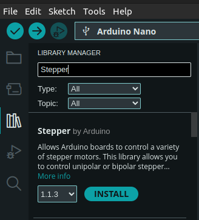

# Stepper motor
**Contents**
* toc
{:toc}
You should be pretty familiar with Arduino by now. Let's do something more practical such as spinning
a motor, stepper motor in fact!

Quick intro to stepper motors. There are two types of stepper motors considering winding (a fancy word for determining a way each coils are wired inside the motor):
* unipolar[^1] - electricity usually flows in one direction, which can be easily controlled by a simple
transistor. Inside of such a stepper motor, two coils are connected with a common lead. You need to generate a correct sequence to drive it.
* bipolar[^2] - electricity flow must be reverted to change a direction of a shaft spin. This is normally achieved with a help of an H-bridge

In this tutorial we shall handle only the unipolar case. Still, once you get the idea of controlling
unipolar motors, it won't be difficult to learn controlling the bipolar ones. Hope, you bought 
28BYJ-48 stepper motor along with ULN2003 driver. The driver is a [Darlington chip](https://en.wikipedia.org/wiki/Darlington_transistor).

Make sure you connect your stepper correctly. This table should help you:

| Driver  | Arduino Nano | Atmega Pinout |
|---------|--------------|---------------|
| IN1     | D4           | PD4           |
| IN2     | D5           | PD5           |
| IN3     | D6           | PD6           |
| IN4     | D7           | PD7           |
| + 5-12V | 5V           | 5V            |
| -       | GND          | GND           |

You may also want to see this demonstration prior entering the next sections: [Youtube: Stepper Motors: What is the Difference Between Full-Step and Half-Step Modes?](https://www.youtube.com/watch?v=dmk6zIkj7WM&ab_channel=AnaheimAutomation%2CInc).
You can watch this video to understand how stepper motors work:
* [Youtube: How does a Stepper Motor work? Full lecture](https://www.youtube.com/watch?v=VMwv4XFZ2L0&ab_channel=learnchannel) 
* [Youtube: How does a Stepper Motor work?](https://www.youtube.com/watch?v=eyqwLiowZiU&ab_channel=Lesics)

There are many resources on controlling stepper motors in the Web. You can certainly look it up! This
tutorial focuses on more practical aspects.

## Full step control

In a full step control, you consecutively turn on and turn off LEDs, one after another. If `0` is led
off and `1` is led on, you can think about it as this series:

```
0001
0010
0100
1000
```

Yes, to control a stepper motor, you effectively turn on LEDs in sequence...
Let's take a look at Arduino code, then Atmega one with some fancy bit shifts!

Source - [Arduino Full Step Control](./assets/code/chapter_4/stepper_full_step_arduino/stepper_full_step_arduino.ino):

```
#define COIL_1 7
#define COIL_2 6
#define COIL_3 5
#define COIL_4 4

#define DELAY_MS 4
void clearStepperPins() {
  digitalWrite(COIL_1, LOW);
  digitalWrite(COIL_2, LOW);
  digitalWrite(COIL_3, LOW);
  digitalWrite(COIL_4, LOW);
}

void setup() {
  pinMode(COIL_1, OUTPUT);
  pinMode(COIL_2, OUTPUT);
  pinMode(COIL_3, OUTPUT);
  pinMode(COIL_4, OUTPUT);
}

void loop() {
  clearStepperPins();
  digitalWrite(COIL_1, HIGH);
  delay(DELAY_MS);

  clearStepperPins();
  digitalWrite(COIL_2, HIGH);
  delay(DELAY_MS);

  clearStepperPins();
  digitalWrite(COIL_3, HIGH);
  delay(DELAY_MS);

  clearStepperPins();
  digitalWrite(COIL_4, HIGH);
  delay(DELAY_MS);
}
```

There are for `#define` statements that provide a pinout as suggested in the table above. It's a good
practice to create constants for your pinouts. It's easier to change it in future and, most 
importantly, improves readability.

`clearStepperPins()` simply turns off all stepper pins. `setup()` opens these pins as an output device. You saw these steps earlier. Now, LED blinking time... well, servo controlling time!

The `loop()` part simply follow a pattern presented above: `0001 -> 0010 -> 0100 -> 1000`. Note the
`delay()` function there. It's mandatory! Your microcontroller works in 16MHz frequency. Coils in your
motor don't. There's inertia, there's magnetic flux, there is transistor capacitance etc. I mean, you 
interact with the real world. Some (if not most) bits work slower that a CPU frequency. You may need to
find a proper delay value `DELAY_MS` on your own to maximize angular velocity of the shaft. It's more
trial-and-error than you think. I managed to get satisfying results with `4ms -> 250Hz`.

Hope the code is self explanatory. If your stepper still doesn't spin, make sure you connected it
accordingly. Check GND leads! Check power source and check if no loose leads hanging in the air. If 
you see tiny movements, you may want to experiment with `#define` pinout and change a sequence. Yet 
again, trial-and-error. You'll get used to.

We're done with Arduino approach. Let's take a look at Atmega, registry-based implementation 
(source: [Arduino Full Step Atmega](./assets/code/chapter_4/stepper_full_step_atmega/stepper_full_step_atmega.ino)):

```
#define COIL_1 (1<<PD7)
#define COIL_2 (1<<PD6)
#define COIL_3 (1<<PD5)
#define COIL_4 (1<<PD4)

#define DELAY_MS 5

void move_stepper_full_step_naive() {
  PORTD = COIL_1;
  _delay_ms(DELAY_MS);
  PORTD = COIL_2;
  _delay_ms(DELAY_MS);
  PORTD = COIL_3;
  _delay_ms(DELAY_MS);
  PORTD = COIL_4;
  _delay_ms(DELAY_MS);
}

void move_stepper_full_step_clockwise_smart() {
  PORTD = COIL_1;
  while (!(PORTD & COIL_4)) {
    _delay_ms(DELAY_MS);
    PORTD >>= 1;
  }
  _delay_ms(DELAY_MS);
}

void move_stepper_full_step_counter_clockwise_smart() {
  PORTD = COIL_4;
  while (!(PORTD & COIL_1)) {
    _delay_ms(DELAY_MS);
    PORTD <<= 1;
  }
  _delay_ms(DELAY_MS);
}

int main() {
  DDRD = COIL_1 | COIL_2 | COIL_3 | COIL_4;
  PORTD = 0x00;
  while (true) {
      move_stepper_full_step_clockwise_smart();      
  }
}
```

`#define` statements should look familiar. If not, check Arduino Nano pinout picture for details.
*PD4..7* correspond to to Arduino pins D4..7.

`move_stepper_full_step_naive()` implements a naive full step stepper control. It's naive because
it uses the whole `PORTD` register to set up a value on PINs. If you decide to use anything else
in parallel, the function shall override your pin states. Moreover, this repetetive assign-delay 
sequence certainly can be optimized! Although, copy-paste approach is not always a bad idea in
microcontrollers. Sometimes it's better to use more disk space for you hex program 
rather than compute these values on flight and lose precious CPU cycles.

I really hope, you noticed a pattern in this sequence: `0001 -> 0010 -> 0100 -> 1000`. If not,
well, you certainly can apply some bit shifts here and make code more elegant! This is what
these two functions do: `move_stepper_full_step_clockwise_smart`, 
`move_stepper_full_step_counter_clockwise_smart()`. To shift a bit you can use these two operators: `<<=`, `>>=`. This is a shorter form of: `PORTD = PORTD << 1`. BTW, this effectively multiplies/divides
by two! Magic of binary numbers.

The `while()` loop performs bit shifts until it reaches the final bit in the sequence, the forth lead.
The operation then must start from the beginning, from the first lead. Mind `_delay_ms()` function!
It's crucial to give your hardware some time *to think* ;).

## Half step control

Full step method activates a single coils and expects a stator is attracted to the coil. In the half
step control, you can activate two coils to catch the stator in between! The stator is hold
between the full step, hence the half step control. It means there are 8 separate states that one needs to handle:

```
FULL=01, binary=0b0001
HALF=03, binary=0b0011
FULL=02, binary=0b0010
HALF=06, binary=0b0110
FULL=04, binary=0b0100
HALF=12, binary=0b1100
FULL=08, binary=0b1000
HALF=09, binary=0b1001

FULL=01, binary=0b0001
[and so on...]
```

You can generate this sequence with [a simple python script](./assets/code/chapter_4/half_step_sequence_generator.py):

```
def half_step_sequence_generator():
  MAX_ALLOWED_ITERATIONS = 4
  iteration_count = 0;
  
  while not iteration_count >= MAX_ALLOWED_ITERATIONS:
    PORTD = 1;
    print(f"FULL={PORTD:02d}, binary=0b{PORTD:04b}")
    while not (PORTD & 1<<3):
      previous_step = PORTD;
      PORTD = (PORTD<<1) | PORTD;
      print(f"HALF={PORTD:02d}, binary=0b{PORTD:04b}")
      PORTD &= ~(previous_step);
      print(f"FULL={PORTD:02d}, binary=0b{PORTD:04b}")
    
    iteration_count += 1
    PORTD |= 1 << 0;
    print(f"HALF={PORTD:02d}, binary=0b{PORTD:04b}")
```

Still, half step mode is all about triggering LEDs in sequence (source [Arduino Half Step Atmega](./assets/code/chapter_4/stepper_half_step_atmega/stepper_half_step_atmega.ino)):

```
#define COIL_1 (1<<PD7)
#define COIL_2 (1<<PD6)
#define COIL_3 (1<<PD5)
#define COIL_4 (1<<PD4)

#define DELAY_MS 2

void move_stepper_half_step_naive() {
  PORTD = COIL_1;
  _delay_ms(DELAY_MS);

  PORTD |= COIL_2;
  _delay_ms(DELAY_MS);

  PORTD = COIL_2;
  _delay_ms(DELAY_MS);

  PORTD |= COIL_3;
  _delay_ms(DELAY_MS);

  PORTD = COIL_3;
  _delay_ms(DELAY_MS);

  PORTD |= COIL_4;
  _delay_ms(DELAY_MS);

  PORTD = COIL_4;
  _delay_ms(DELAY_MS);

  PORTD |= COIL_1;
  _delay_ms(DELAY_MS);
}

void move_stepper_half_step_clockwise_smartish() {
  uint8_t previous_step = PORTD;
  PORTD = COIL_1;
  while (!(PORTD & COIL_4)) {
    previous_step = PORTD;
    _delay_ms(DELAY_MS);
    PORTD = (PORTD>>1) | PORTD;
    _delay_ms(DELAY_MS);
    PORTD &= ~(previous_step);
  }
  _delay_ms(DELAY_MS);
  PORTD |= COIL_1;
  _delay_ms(DELAY_MS);
}

void move_stepper_half_step_counter_clockwise_smartish() {
  uint8_t previous_step = PORTD;
  PORTD = COIL_4;
  while (!(PORTD & COIL_1)) {
    previous_step = PORTD;
    _delay_ms(DELAY_MS);
    PORTD = (PORTD<<1) | PORTD;
    _delay_ms(DELAY_MS);
    PORTD &= ~(previous_step);
  }
  _delay_ms(DELAY_MS);
  PORTD |= COIL_4;
  _delay_ms(DELAY_MS);
}

int main() {
  DDRD = COIL_1 | COIL_2 | COIL_3 | COIL_4;
  PORTD = 0x00;
  while (true) {
      move_stepper_half_step_clockwise_smartish();      
  }
}

```

`move_stepper_half_step_naive()` implements the presented sequence forcefully. Note `DELAY_MS` has 
been halved to keep the same angular velocity. This is because the application performs 8 steps rather than 4 to complete a full cycle.

`move_stepper_half_step_clockwise_smartish()`, `move_stepper_half_step_counter_clockwise_smartish()` functions attempt to provide a more algorithmic approach for the sequence. I can see some room for
improvement there i.e., redundant allocation of `previous_step`. You can try and optimize it as an exercise!

## Microstepping

Go see [automate.org](https://www.automate.org/case-studies/what-is-the-difference-between-full-stepping-the-half-stepping-and-the-micro-drive) for more info or microstepping. 

## Arduino libraries

Obviously, Arduino is a great framework and with the great framework, there are good libraries.
You can use variety of Stepper motor libraries. I'd say there are two the most popular:
* Stepper[^3] - allows controlling a single stepper motor, good for simple applications
* AccelStepper[^4] - allows controlling multiple steppers at almost the same time.

If you decide to use one of these libraries, you need to do some math too. Most of stepper
motors have very little torque. Therefore, such a stepper usually comes with a gearbox. 28BYJ-48 stepper performs ~2048 steps per single revolution[^5]. You can consider it as a *max speed*, or
max steps threshold. Anything less than that simply reduces angular velocity.

I'll let you analyze *Stepper* example on your own. Go to `Tools->Manage Libraries...` and type `Stepper`. Select `Stepper by Arduino`:



Once you complete this step, go to `File -> Examples -> Stepper -> <<one of the available examples>>`.

You can install `AccelStepper` library in the very similar way. Do it! This is a sample code you can
play with (source: [Arduino AccelStepper](./assets/code/chapter_4/stepper_accelstepper_example/stepper_accelstepper_example.ino)):
```
#include <AccelStepper.h>

static const AccelStepper wheel(AccelStepper::HALF4WIRE, 7, 5, 6, 4);

void setup() {
                            // steps per revolution: 2048
  wheel.setMaxSpeed(768);   // max steps per second,
                            // simply guesstimated
  wheel.setSpeed(768);
}

void loop() {
  wheel.runSpeed(); // move a wheel by a step.
                    // try really hard not to block anything in `loop()`, see the docs
}

```

Note that the library uses a different sequence of pins. See constructor documentation for more
details[^6]. The documentation doesn't provide a pinout sequence. You need to determine it on
your own or... change the wiring. Yet another heuristic step and trial-and-error approach.

`AccelStepper::setMaxSpeed()` function requires max steps per second parameter. There is no clear documentation on
that so this is guestimation as well. My stepper works well with 768steps/second quite well.

`AccelStepper::setSpeed()` sets the current speed for the stepper. You can change it dynamically if you want. The 
library offers a more precise control: applying a predefined number of steps. This is good if you want
to move a certain distance with your robot. We'll get there!

Finally, `AccelStepper::runSpeed()` applies another step. Note that there should be no blocking waits
in the main `loop()` of the program. Otherwise, your will won't spin. Keep your main loop as short as
possible to provide smooth stepper experience. 

Sorry, you can't really spin up another thread... well, you can use a timer to perform an action inside asynchronously (to a degree). Let's give it a try. This time, I'm using Timer2 and CTC mode. Timers can create PWM signals but also can precisely measure time and execute an action when
an internal counter clears.

I want to set up something that allows to run 768ticks in a second. The formula for CTC is (see: 
*Figure 17-5. CTC Mode, Timing Diagram*[^7]):

$$ f_{OCnx} =  \frac {f_{clk_{I/O}}}{2 \cdot N \cdot (1 + OCR_{nx})}$$

OCR<sub>nx</sub> should be then:
$$ OCR_{nx} =  \frac {f_{clk_{I/O}}}{2 \cdot N \cdot f_{OCnx}} - 1$$
where:
  * OCR<sub>nx</sub> - value to clear/trigger an event, must be 8-bit value
  * `N` - prescaler
  * f<sub>clkI/0</sub> = 16MHz
  * f<sub>OCnx</sub> - desired frequency, here: 768Hz

clearly, N=64 seems to be a good solution, `OCR_{nx} = 161,7604... ~= 162`. This precision is good 
enough for all purposes. It's a systematic error that you can compensate later. You also need an ISR
vector for the OCR2. You can find it in `#include <avr/io.h>` or `#include <avr/iom328p.h>` file.
`TIMER2_COMPA_vect` is a choice of ours (`TIMER2_COMPB_vect` will not be allocated, let's leave it).
Now we have all we need, let's code!

> [!NOTE]
> Sometimes you cannot precisely set up a timer or compute gear ratio or anything. It causes a
> systematic error[^8]. In our case it's caused by imperfect calibration[^9]. You'll see effects
> of this error to grow over time. You can compensate it just like we do so in... 
> [Gregorian Calendar](https://en.wikipedia.org/wiki/Gregorian_calendar) and leap year. Hope, you
> get the analogy.

Let's see the full code with the timer set accordingly (source: [AccelStepper and CTC Timer2](./assets/code/chapter_4/stepper_accelstepper_ctc_timer/stepper_accelstepper_ctc_timer.ino)):

```
#include <AccelStepper.h>
#include <avr/interrupt.h>

static const AccelStepper wheel(AccelStepper::HALF4WIRE, 7, 5, 6, 4);

void setup() {
  // configure Timer2 as CTC at frequency 768Hz
  TCCR2A = (1<<COM2A1)   // Clear on compare match
           | (1<<WGM21); // CTC

  TCCR2B = (1<<CS22);    // prescaler = 64
  OCR2A = 162;           // OCR_nx = 162, as derived in calculations
  TIMSK2 = (1<<OCIE2A);  // enable interrupt on COMPA

  // steps per revolution: 2048
  wheel.setMaxSpeed(768);  // max steps per second,
                           // simply guesstimated
  wheel.setSpeed(768);
}

void loop() {
  delay(1000); 
}

ISR(TIMER2_COMPA_vect) {
  wheel.runSpeed();  // move a wheel by a step.
                     // try really hard not to block anything in `loop()`, see the docs
}
```

The main difference is the timer configuration. Please, review *PWM* chapter if this config does
not look familiar. That's the very same principle, just a different mode (here: *CTC*, there: *Phase 
Correct PWM*). Clearly, stepper motors are now handled by an ISR routine. All bit switching happens
in the background, outside of the main loop. The drawback is of course you can no longer use this
timer as a PWM generator, unfortunately. Tradeoffs!

That's all I wanted to present you in this chapter. You know how to implement your own stepper
library and use an off-the-shelf one in two ways. You are more than ready to use this knowledge
to build a decent robot chassis controlled with stepper motors. We'll integrate this knowledge
in the last chapter of this tutorial. For now, let's move to the next chapter.


# References
[^1]: [Unipolar stepper motor](https://en.wikipedia.org/wiki/Stepper_motor#Unipolar_motors)
[^2]: [Bipolar stepper motor](https://en.wikipedia.org/wiki/Stepper_motor#Bipolar_motors)
[^3]: [Arduino Stepper library](https://www.arduino.cc/reference/en/libraries/stepper/)
[^4]: [AccelStepper library](https://github.com/waspinator/AccelStepper)
[^5]: [Last Minute engineering: Servo tutorial](https://lastminuteengineers.com/28byj48-stepper-motor-arduino-tutorial/)
[^6]: [AccelStepper - constructor docs](https://www.airspayce.com/mikem/arduino/AccelStepper/classAccelStepper.html#a3bc75bd6571b98a6177838ca81ac39ab)
[^7]: [Atmega328P Datasheet](https://ww1.microchip.com/downloads/en/DeviceDoc/Atmel-7810-Automotive-Microcontrollers-ATmega328P_Datasheet.pdf)
[^8]: [Systematic error](https://www.sciencedirect.com/topics/engineering/systematic-error)
[^9]: [Wiki: Sources of systematic errors](https://en.wikipedia.org/wiki/Observational_error#Sources_of_systematic_error)