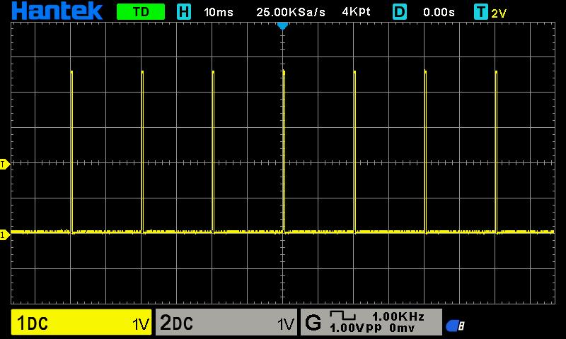
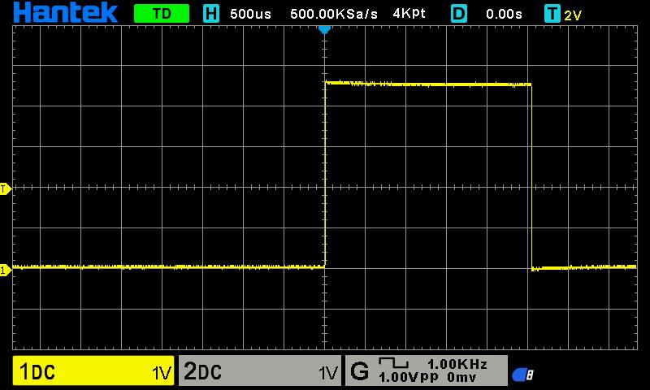

# Servo control
**Contents**
* toc
{:toc}
This chapter is all about servomechanisms, servos for short. You will learn: 
* What is a servo? How does it work?
* How to connect a servo?
* How to control a servo?
* Different types of servos

## Theory

A servomechanism (servo) is a feedback system that uses a closed-loop controller to set
and actively adjust its position and/or velocity as an actuator[^1], [^2]. There are many types of
servos i.e., hydraulic, pneumatic, electric [^1]. In this tutorial, we shall use a typical
positional rotation DC motor servos, often used in RC control models.

Let's quickly decipher the definition to fit our context:
* servo does rotate
* servo does keep its position
* servo can be controller with a microcontroller

Internally, a servo is an effector (here: a DC motor) wrapped with electronics that read and control its position. To read a position you need some sort of [*encoder*](https://en.wikipedia.org/wiki/Encoder_(position)). You also need a control mechanism/circuitry to read the position and correct it.
Often, it's a microcontroller with custom software, usually a [PID controller](https://en.wikipedia.org/wiki/Proportional%E2%80%93integral%E2%80%93derivative_controller). Finally, the servo needs to
actuate in the real world. 5V/20mA is barely enough to light up an LED. The DC servo comes with
an [H-bridge](https://en.wikipedia.org/wiki/H-bridge) to control position and power in the DC motor. The servo also may need gears (gearbox) to increase output torque. All of it comes in a small and usually affordable package!

Hopefully, you bought SG92(R) servo. It's a small servo that offers a decent torque in a small package. There are three wire leads: brown, red, orange. Colors may vary in tinge. The middle one, the
red one is a positive power supply. You'll connect 5V there. The brown one is GND. The orange one
is PWM signal, which controls the position of the servo. Make sure you connect it to PB1 pin.
The pinout of the servo is pretty smart. 5V lead in the middle effectively prevents you from applying
wrong polarity. If you connect the PWM lead to GND by mistake, nothing will happen! Of course, try
always to connect your hardware correctly.

| Servo  | Arduino Nano | Atmega Pinout |
|--------|--------------|---------------|
| Orange | D9           | PB1           |
| Red    | 5V           | N/A           |
| Brown  | GND          | N/A           |


There are many tutorials in the Web. You can google them or simply use one of the below links:
* [Arduino - Basic servo control](https://docs.arduino.cc/tutorials/generic/basic-servo-control/)
* [Adafruit - Servo tutorial](https://learn.adafruit.com/adafruit-arduino-lesson-14-servo-motors/overview)

Now, how to control it?
* 50Hz PWM signal
* 5%-10% duty cycle, to control its position between its maximum ranges 
(often 0 to 180deg)[^4]. There are lots of variations on it[^5]. From my experience, this is a good
approximation but still it's better to calibrate the values on your own. 
* Power supply and GND are also welcomed :)

## Servo library

Arduino IDE comes with *Servo* library included[^3]. The library uses 16-bit timer to provide
precise timing to control servos. The library can control up to 60 servos, depending on a microcontroller we use.

There is an official Arduino Servo tutorial if you need a different perspective on basics[^6].

Let's take a look at an example (source: [Arduino Servo library: Hello World!](./assets/code/chatper_5/01_servo_hello_world/01_servo_hello_world.ino)):

```
#include <Servo.h>

static constexpr const uint8_t SERVO_PIN {9};
static Servo servo;

void setup() {
  servo.attach(SERVO_PIN);
}

void loop() {
  for (uint8_t angle = 0; angle <= 180; angle += 45) {
    servo.write(angle);
    delay(1000);
  }
}
```

The first line `#include <Servo.h>` includes the *Servo* library. It comes with Arduino IDE so you 
don't need to install anything. The servo device uses pin #9 as suggested in the pinout table above.
Moreover, you need to create an object of type `Servo`: `static Servo servo;`.

The next step is to simply connect the servo object (software) with your *more* tangible servo, the hardware on pin 9: `servo.attach(SERVO_PIN); // SERVO_PIN=9`.

Finally, we want to use the servo, so it's business time. The logic shall move servo handle/hook/rudder
in increments of 45 degrees. To issue a command and set a desired position, you need to run `servo.write(angle);` command. Don't forget about a reasonable delay so the servo change can take an effect.

Once you compile the software and deploy it to your microcontroller, you'll how the servo moves.
Congratulations! It's working! It's alive!


The servo moves but the manual mentions 0-180 degree range. My servo certainly doesn't meet the specification, at least for now. You need to calibrate it. Luckily, the library allows you to attach
a servo and defining a pulse width for PWM signal. Remember? 5%-10% duty cycle. Let's involve some
trial and error then...

Let's take a look at another example (source: [Arduino Servo Calibration](./assets/code/chatper_5/02_servo_calibration_json/02_servo_calibration_json.ino)):

```
#include <Servo.h>
#include <ArduinoJson.h>

static constexpr const uint8_t SERVO_PIN {9};
static Servo servo;

static JsonDocument json;

inline void applyServoPosition(uint8_t angle);

void setup() {
  Serial.begin(115200);
  servo.attach(SERVO_PIN, 540, 2540);       // calibrated servo  
  servo.write(0);

  while (!Serial);
}

void loop() {
  if (Serial.available() > 0) {
    auto error = deserializeJson(json, Serial);
    if (!error) {
      applyServoPosition(
        static_cast<uint8_t>(json["pos"])); // contract: pos shall be in range 0-180
      serializeJson(json, Serial);
      Serial.println();
    }
  }
}

void applyServoPosition(uint8_t angle) {
  servo.write(angle);
}
```

The example employs *ArduinoJson* and *Serial* to let you control the servo with your Serial Monitor.
The calibration for such a servo can be complicated task if you need to perform extra precise 
operations (see: [Metrology](https://en.wikipedia.org/wiki/Metrology)). It can be also very simple if 
you need it for non-critical applications. As like simple routes, let's play with this line: `servo.attach(SERVO_PIN, 540, 2540)`.
How did I do it? Well, you need to issue a command:

```
{"pos":0}
```

in Serial Monitor. Then, you take a look at the servo and see if the handle is parallel enough to the 
servo case. The first value *540* is the minimum (by default Arduino uses: *544*). You subtract
the value if the parallelism is overshot or add if the handle goes back a bit too much. You take a similar approach for the next position:

```
{"pos":180}
```
You issue this command in the Serial Monitor. By default, Arduino assumes the max value to *2400*.
Clearly, my handle never reached real 180 degree movement so I needed to increase it up to *2540*.
The magic values you enter are microseconds (*1us=10<sup>-6</sup>s*). The library uses 16 bit timer
to generate interrupts at frequency of 2MHz (16MHz CPU freq, and prescaler=8), which translates to 
*0,0000005s = 0.5us` resolution. This is how often the library processes an ISR procedure to
mimic PWM and apply correct duty cycle for up to 60 servos! Science? Magic? No, it's engineering!
If you are interested how it's really implemented, I suggest you take a look at the original source
code[^7].

Assuming you use Cytron's Nano board, you also should see how the D9 LED changes its brightness.
This is of course a sign of PWM, although implemented with software means. How does a waveform
look like? An oscilloscope can provide some details:


*<br />Figure: Oscilloscope - servo at 0 deg, zoom out*


*<br />Figure: Oscilloscope - servo at 0 deg, zoom in, 500us grid resolution*


*<br />Figure: Oscilloscope - servo at 180 deg, zoom out*



*<br />Figure: Oscilloscope - servo at 180 deg, zoom in, 500us grid resolution*

Take a look at any *zoom-out* chart, with *10ms* resolution. The diagram is showing peaks at 20ms
intervals, which translates to 50Hz PWM frequency. The *zoom-in* diagram is scaled in *500us* resolution. You can see how wide the peak is, which in our case is slightly more than 500us and 2500, just as we programmed it! Isn't it wonderful?

Alright, we're done with the library. Go ahead and check the documentation or simply see the library
header for details[^8]. What if you don't want to trigger 2 million interrupts every second? Well,
this brings us back to a hardware-based solution. Yes, you guessed it. It's time to generate
hardware PWM at 50Hz and use it as the output.

## Hardware-based servo control

Actually, we did exercise this bit earlier in the tutorial. Remember PWM section in [Analog input, Pulse Width Modulation](chapters/2_analog_and_pwm.md) chapter? Go ahead!

You can use up to two servos with the 16-bit timer in Atmega328p. It's not much. Remember, you can
always design your own board that controls many more servos. Really, it's just a question of
requirements and some engineering decisions. Arduino *Servo* library is a very good one of amateur
projects as it lowers an entry threshold to get started with. With more advanced projects
you will know when to make the right decisions to balance costs vs complexity vs timing requirements 
(vs other parameters). This is engineering :). Simply, delivering good tradeoffs.

Ok. That's enough of coaching. Let's take a look at the code:


# References
[^1]: [Wiki - Servomechanism](https://en.wikipedia.org/wiki/Servomechanism)
[^2]: [ScienceDirect - Servomechanism](https://www.sciencedirect.com/topics/engineering/servomechanism)
[^3]: [Arduino - Servo library](https://www.arduino.cc/reference/en/libraries/servo/)
[^4]: [SparkFun - PWM](https://learn.sparkfun.com/tutorials/pulse-width-modulation/all)
[^5]: [Wiki - Servo Control](https://en.wikipedia.org/wiki/Servo_control)
[^6]: [Servo Motor Basics with Arduino](https://docs.arduino.cc/learn/electronics/servo-motors/)
[^7]: [AVR Servo library implementation](https://github.com/arduino-libraries/Servo/blob/master/src/avr/Servo.cpp)
[^8]: [Servo Library for Arduino](https://github.com/arduino-libraries/Servo/tree/master)