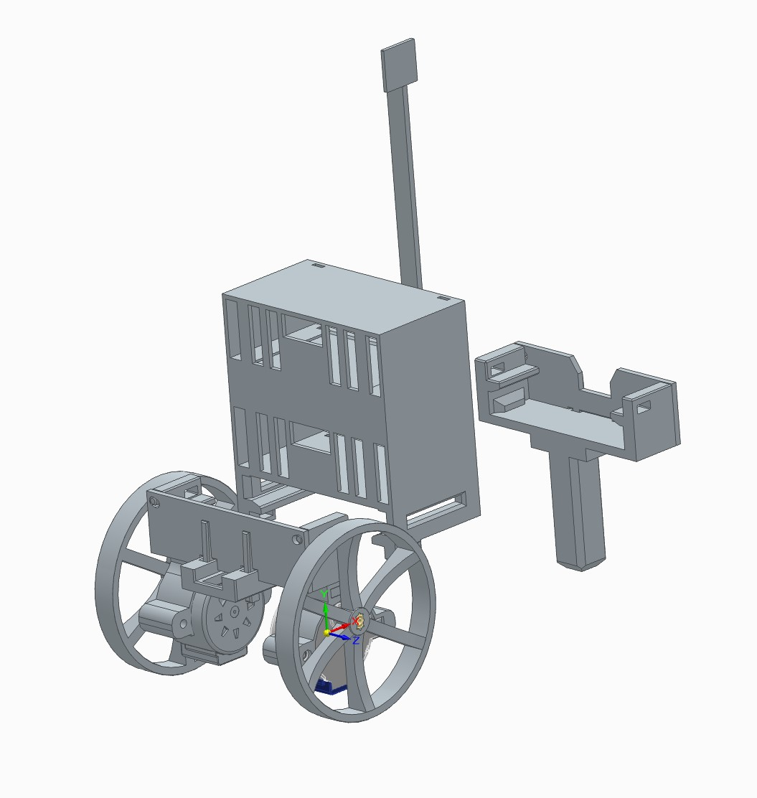
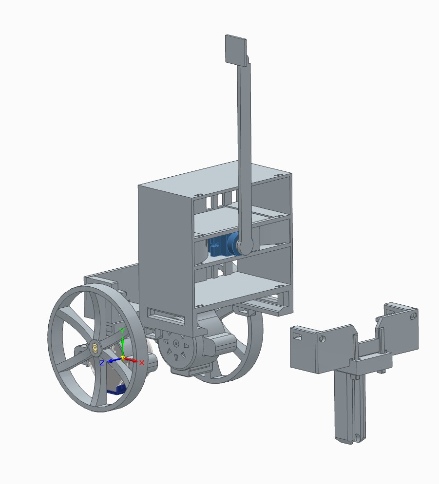
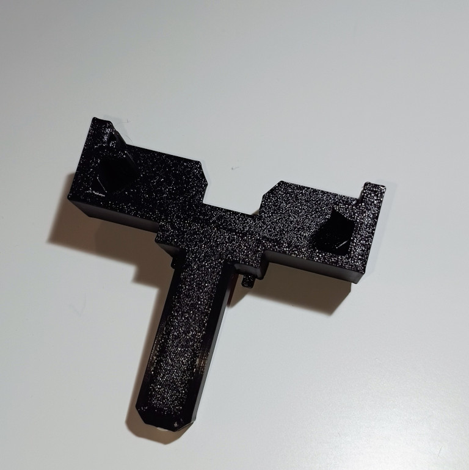
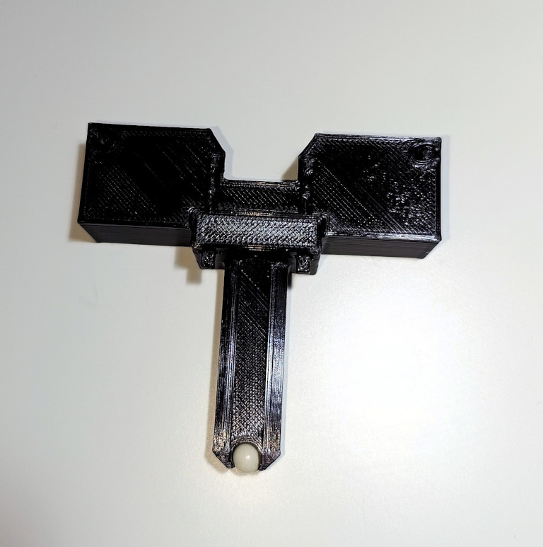
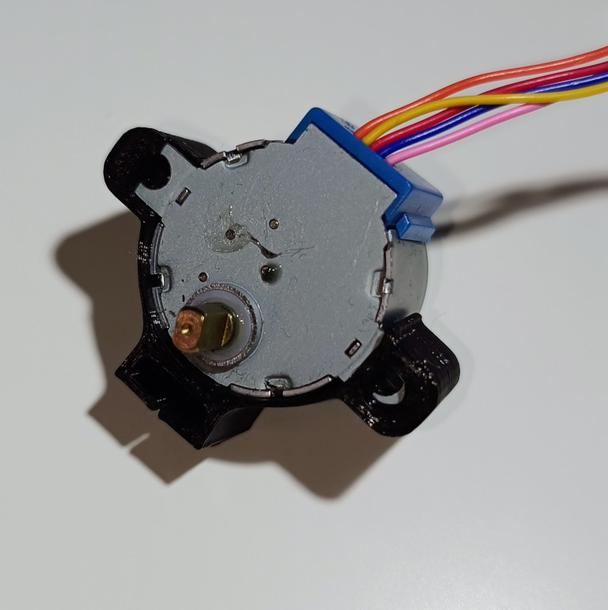
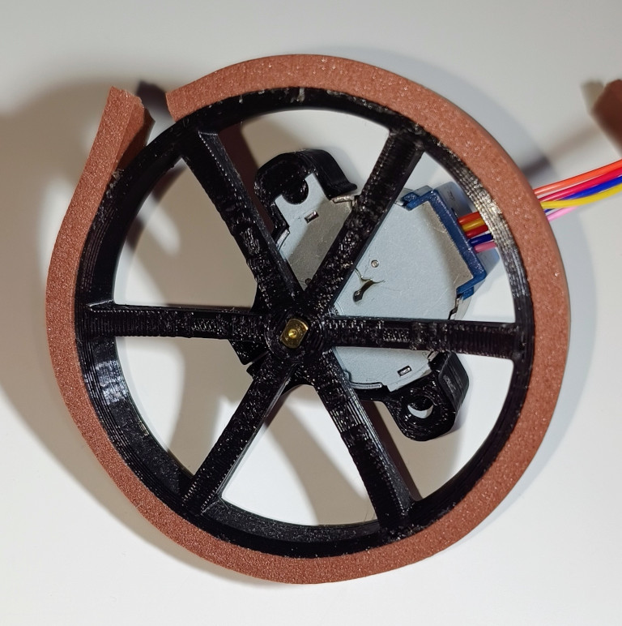
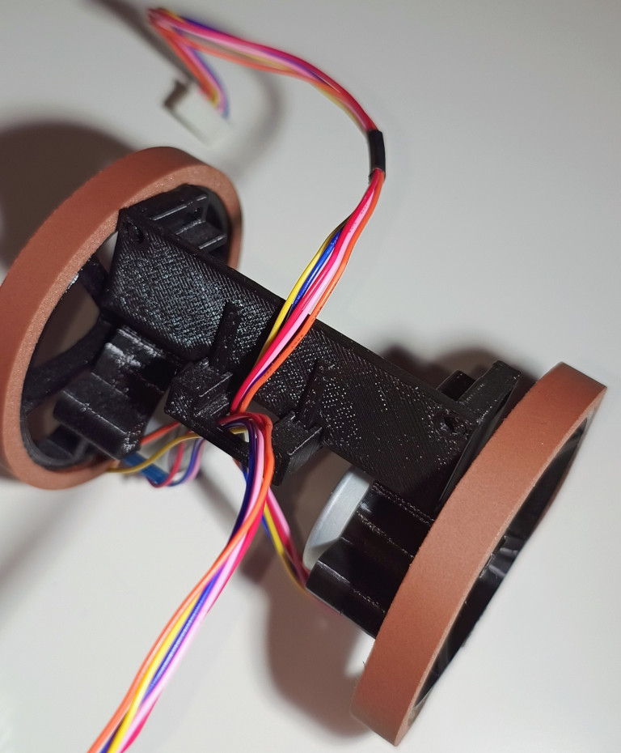
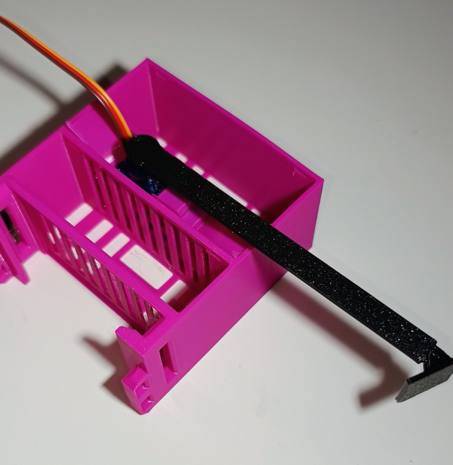
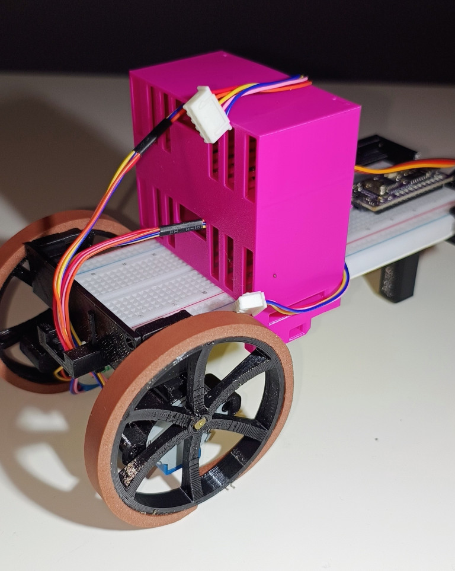
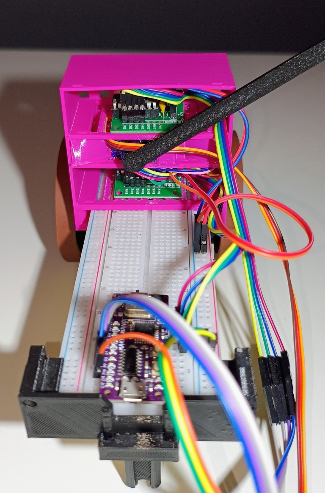

# Robot integration
**Contents**
* toc
{:toc}
You've learned so much. Let's put that into practice and finally build your own robot!


## Introduction

Alright! You want to build a robot. This is the right place. I can simply provide you some steps
to achieve it. Still, this is not a purpose of this exercise. Let's think a bigger picture - engineering.

Normally, someone creates an item, a tangible object to fulfil a need. It can be a minor thing but
still its goal is to satisfy the need. Well? Why do we need to build a robot? 
It's fun, for sure. You also want to familiarize yourself with basics of microcontrollers and coding.
You did it in previous chapters. You are quite proficient at it! 
This chapter really integrates the knowledge. IMO, Building
a robot is the coolest way to do it. What sort of goals can we achieve with the robot? Are there any
alternatives? What's the context, etc.?

An engineer must ask a lot of questions to really understand the problem. After all, we try to solve
human problems rather than build cool stuff. (I know, here we intend to build cool stuff too. 
I generalize)

So what's our main mission? Say, you can bid a DARPA contract to win a robotic office battle. The
bid comes with a set of requirements you are expected to meet. Also the budget is limited, as DARPA
is willing to pay no more than €30 for a single robot. Specification can look like this:
* **DARPA/GENERAL/OFFICE-BATTLE/REQ/0010**: A device is a mobile platform, dimensions no greater than 20x20x10cm (length x width x height)
* **DARPA/GENERAL/OFFICE-BATTLE/REQ/0020**: The device shall be controlled over wire
* **DARPA/GENERAL/OFFICE-BATTLE/REQ/0030**: The device shall use commonly available off-the-shelf components
* **DARPA/GENERAL/OFFICE-BATTLE/REQ/0040**: The device shall compete non-destructively with other competitors to score points
* **DARPA/GENERAL/OFFICE-BATTLE/REQ/0050**: The device should not be equipped in any agent-dispersing equipment
    * (Consider this requirement as no flamethrowers, no chemical weapons, no shooting)
* and so on

The specification can of course be presented in different forms, formatting and so on (i.e., a few 
blocks of text...). Eventually, it's up to you to identify all possible requirements and assumptions 
to meet your client's needs. You can learn a bit more about it by reviewing some university competitions such as [Rules - European Rover Challenge](https://drive.google.com/file/d/1jZyn9oY7vqMJMvXQyE6EeLh7gRC0LpJh/view?usp=drive_link) or [Rules - University Rover Challenge](https://urc.marssociety.org/home/requirements-guidelines)

Note the language. Verbs such as is/shall/should/may/can/etc., one precise item mentioned in each 
bullet. The language of such requirements in the specification tries to be very detailed. 
In reality, even the most detailed description tends to be barely a draft once you attempt 
to implement it. There are simply too many factors to predict. 
Still, I wish you always get all the specs with no ambiguity.
Note the enumeration too. It's not always the case but usually it helps to navigate in documents
if you provide a decent convention. Imagine you need to talk to your client and discuss 
an unclear requirement. You can say that: on the 3rd page, 8th paragraph, second sentence the
requirement states that... and so on. Lots of words, too many actually. The enumeration helps
tracking this sort of problems in formal procurements as well as in future discussions.

The bid comes with a specification that defines a series of requirements. 
Now you need to model your further activities. What sort of actions the device, 
or from now on a robot, shall take? What
are the *rules of engagement*? Should the robot fight automatically? How to strike an opponent
within the given rules? How you can flex those rules, so it gives you market advantage :)?
There is lots of thinking involved... What are your skills (although it's not as important as it
can look like)? What's the budget? And so on...

The modelled design shall be presented in a form of a proposal. Yet again, there are many ways
to skin a cat... If it's a public institution, you might be given some clues, like [here (ESA)](https://www.esa.int/About_Us/Business_with_ESA/How_to_do/Preparing_a_technical_proposal)
or [here (NASA)](https://www.nasa.gov/wp-content/uploads/2022/02/2021_ed._nasa_guidebook_for_proposers.pdf).

Let me model that for you:
* **RB-GENERAL-REQ/0010**: The robot shall be a two wheel construction
* **RB-GENERAL-REQ/0020**: The robot shall be [controlled differentially](https://en.wikipedia.org/wiki/Differential_wheeled_robot)
* **RB-GENERAL-REQ/0030**: The robot shall be controlled at max distance of 1.5m from its control station (PC)
* etc.
* **RB-COMBAT-REQ/0010**: The robot shall engage at max distance of 12cm
* **RB-COMBAT-REQ/0020**: The robot shall shall strike an opponent by hitting it from top
* **RB-COMBAT-REQ/0030**: The robot shall shall perform at least 1 strike per second
* **RB-COMBAT-REQ/0040**: The robot may count received hits and announce opponent's score by
emitting a sound signal

These requirements shall convert into the following assumptions:
* **RB-GENERAL-IMPL/0010/REF:RB-GENERAL-REQ/0010**: The robot shall utilize 28BYJ-48 stepper motors to drive
* **RB-GENERAL-IMPL/0020/REF:RB-GENERAL-REQ/0010**: The robot shall be equipped with a set of wheels
 7-7.5cm in diameter, 3D-printed in PLA, rubberized tread
* **RB-GENERAL-IMPL/0030/REF:RB-GENERAL-REQ/0020**: The drive model shall be implemented within microcontroller
* **RB-GENERAL-IMPL/0031/REF:RB-GENERAL-REQ/0020**: The drive model shall comprise 4 commands: FORWARD, BACKWARD, TURN_LEFT, TURN_RIGHT. Turning shall be performed in-place. Power setting of min.0-max.255 shall be issued along with the drive command.
* **RB-GENERAL-IMPL/0040/REF:RB-GENERAL-REQ/0030**: The robot shall use microUSB cable and be supplied
with power output provided by USB3.0 (max. 900mA).
    * Comment: Energy budget is important! Each stepper consumes roughly 100-200mA @5V, servo in between 10mA-650mA[^1]. Arduino consumes 50-100mA. It means, the budget of 2x150mA + 300mA + 100mA ~= 700mA is under the total power output provided by USB3.0. We should be good here

* **RB-COMBAT-IMPL/0010/REF:RB-COMBAT-REQ/0010-0020**: The robot shall be equipped with a 12cm PLA-printed arm, driven by a servo mechanism
* **RB-COMBAT-IMPL/0020/REF:RB-COMBAT-REQ/0020-0030**: The combat arm shall be driven by SG-92R servo
* **RB-COMBAT-IMPL/0020/REF:RB-COMBAT-REQ/0040**: The robot should be equipped with a photoresistor
to count every opponent's successful strike

Note how precise this list is! IT IS INCOMPLETE! I didn't specified any programming languages nor
desired microcontrollers. It takes lots of work to complete the documentation. It takes even more
details to recreate a solution described in such a specification... I haven't even provided any 
drawings yet! Testing, maybe? Operational scenarios (a set of typical procedures to follow) and 
alternative scenarios ([FUBAR](https://en.wikipedia.org/wiki/List_of_military_slang_terms#FUBAR) cases).


<br />Figure: Robot, diagonal front isometric view


<br />Figure: Robot, diagonal rear isometric view

Anyway, you should have now a general feeling over how the robot is going to look like: 2-wheels 
controlled with stepper motors and an arm that hits opponent robots from top.

This section was meant to introduce you to an engineering process that you may encounter in your
future work. Quite often, the documentation is the key to success. You can read more on project
management on [Wiki - Project Management](https://en.wikipedia.org/wiki/Project_management).

## Pinout

Make sure you follow the pinout as presented below:

| Device            | Arduino Pin |
| ----------------- | ----------- |
| Servo PWM line    | D9          |
| Right Stepper IN1 | D7          |
| Right Stepper IN2 | D6          |
| Right Stepper IN3 | D5          |
| Right Stepper IN4 | D4          |
| Left Stepper IN1  | PIN_A4      |
| Left Stepper IN2  | PIN_A3      |
| Left Stepper IN3  | PIN_A2      |
| Left Stepper IN4  | PIN_A1      |


You can find the pinout in the code by the following references:
```
WeaponizedServo(uint8_t servoPin = 9, uint16_t deg0Micros=540, uint16_t deg180Micros=2540) 
const AccelStepper rightWheel; // default pinout:  (7, 5, 6, 4)
const AccelStepper leftWheel; //  default pinout: (PIN_A4, PIN_A2, PIN_A3, PIN_A1)
```


## Assembly

Make sure you printed all elements listed in Bill Of Materials!

Full assembly instructions:


<br />Figure: Rear axle: Wall assembly

1) Assemble  `rear_wall.stl` with `chassis_rear_beam_with_airsoft_bearing.stl`. Mind the notches.
The support beams in `rear_wall.stl` should point outwards. See the next figures for more details


<br />Figure: Rear axle: Bearing assembly

2) Insert a 6mm polymer ball into the notch in `chassis_rear_beam_with_airsoft_bearing.stl` at the
bottom


<br />Figure: Install rear axle

3) Insert the breadboard into the axle as shown in the picture. This should fit tight. You can use 
a zip tie to tight the side walls: mind the openings in the sides: you can use it to insert a zip
tie


<br />Figure: Motor assembly

4) Make sure you hold the stepper so the shaft is at the top. Insert the left piece 
into `stepper_motor_case.stl`. The print is elastic, you can bend it to accommodate for the necessary room. With a counterclockwise movement, insert the right piece of the stepper into the slot. Use some force as its very tight by design so no screw/bolts are needed. Perform this step twice


<br />Figure: Install wheel

5) Glue a piece of rubber on top of the wheel. A typical window gasket/seal is good enough

6) Insert the stepper shaft into the slot. It is up to you to pick the wheel facing side



<br /> Figure: Front axle assembly

7) Push each wheel onto `chassis_front_beam.stl`

8) Thread the stepper leads through the bottom opening

9) Install `front_wall.stl` with the support beams facing front. Mind the cables. You should
achieve the overall result as shown in the Figure


<br />Figure: Install Servo

10) Insert the servo into `servo_holder.stl`. There are two opening for the cabling. Make
sure you lay the cables through the openings

11) Insert the combined element into the middle drawer of `driver_tower_with_servo.stl`

12) Assemble the arm by gently installing `servo_arm_effector.stl` onto `servo_arm.stl`

13) Insert an asymmetric handle/needle/rudder into the assembled arm (no photos). The handle
comes with the servo in the same package

14) Push the assembled arm onto servo shaft. Do it gently as you need to calibrate the servo later.



<br />Figure: Install front axle and the driver tower

15) Install the driver tower, so the small openings face forward

16) Install the front axle

17) Thread the stepper leads through the top and bottom notches. You should achieve the result 
as shown in the picture


<br />Figure: Wiring

18) Connect all leads as suggested in the pinout table

19) Lay the cables in a way they have very low chances to interfere with the arm. Use zip ties,
thread, tape to order the cabling

20) We're done here. Move to the coding part :)!

## Coding

I chose more structural approach to write firmware for the robot. It's simply easier to
follow for unexperienced developers. If you familiar with C++ and OOP, you can develop
a hierarchy of classes if you want. Just allocate such objects on stack rather than heap.

### JSON contract

As explained in UART chapter, agreeing on a contract and data serialization is crucial.
In this section, we are going to define a set of commands to control the robot. The following
requirements and assumption provide some details of what's really expected:
* Drive: **RB-GENERAL-IMPL/0031/REF:RB-GENERAL-REQ/0020**
* Servo: **RB-COMBAT-IMPL/0020/REF:RB-COMBAT-REQ/0020-0030**, **RB-COMBAT-REQ/0020-0030**

Let's focus on the drive functionality. There are 4 expected actions:
* FORWARD (mnemonic: `FWD`): moves forward with a given power setting,
* BACKWARD (mnemonic: `BWD`): moves backward with a given power setting,
* TURN_LEFT (mnemonic: `T_L`): turns left with a given power setting, the turning starts only from
a stationary position
* TURN_RIGHT (mnemonic: `T_R`): turns right with a given power setting, the turning starts only from
a stationary position

Additionally, I want to add STOP command:
* STOP (mnemonic: `STOP`): wheels no longer spin, power cut-off, servo returns to its default position

Each mnemonic shall accept values in between: `0..255`. `STOP` mnemonic shall ignore the value but still, make sure to send zero, for API consistency.

You or a control app shall send only one of these mnemonics at the time.
Sample JSON:

```
{
    "FWD|BWD|T_L|T_R|STOP": 0..255
}

# example:
{
    "FWD": 128
}

# another example
{
    "STOP": 0
}

```

Servo definition can look like this:
* HIT (mnemonic `HIT`) - the servo performs a rapid strike and returns to its default position,
the code ignores any numerical value
* SERVO_POSITION (mnemonic: `SPOS`) - sets the servo into a position between 0..180 degrees. Allowed values: 0..180
* STOP (mnemonic: `STOP`) - places the servo to its neutral position

Similarly as in the drive case, you send either one of these two mnemonics:

```
{
    "HIT|SPOS|STOP": 0..180
}

# example (performs a hit):
{
    "HIT": 0
}
```

You can of course combine these commands and keep hitting an opponent while driving:

```
{
    "FWD": 255,
    "HIT": 0
}
```

You may be asking... why mnemonics? Well, microcontrollers have limited resources. Providing
long strings can severely impact on data processing or even cause memory issues. It's better
to keep it safely and use shorter names. Of course, I encourage you to experiment!


### Servo integration and calibration

See the [Controlling Servos](chapters/5_servo.md) chapter to calibrate the servo.

As the **RB-COMBAT-REQ/0020** assumption suggests, the arm should hit from top to bottom. This can be 
interpreted as keeping the arm in a vertical position. The hit would be *fast* move to a 
horizontal position. We can even overshoot a bit for the best *shock and awe* effect :D!.

Once you calibrate the servo, you should know the 0deg and 180deg positions. You can now adjust
the arm location at either of these positions and consider it as your default state. 
So say, the arm is vertical (or slightly tilted towards the hitting direction). 
Then, by applying 0deg or 180 deg position, the servo performs a hit. 
It's a question of how you inserted the servo into the driver tower box. 

This sample allows controlling servo in range 0..180degrees, as suggested by the JSON contract:

```
#include <Servo.h>

class WeaponizedServo {
  const uint8_t SERVO_PIN;
  Servo servo;
public:
  WeaponizedServo(uint8_t servoPin = 9) : SERVO_PIN{servoPin} {}

  void init() {
    servo.attach(SERVO_PIN);
    defaultPosition();
  }

  void changePosition(uint8_t angle) {
    angle = min(angle, 180);
    servo.write(angle);
  }

  void defaultPosition() {
    servo.write(45);
  } 
};

WeaponizedServo sledgehammer;

void setup() {
  sledgehammer.init();
}

void loop() {
  sledgehammer.changePosition(0);
  delay(1000);
  sledgehammer.changePosition(180);
  delay(1000);
}

```

See the `loop()` function. It's a temporary set of commands to simply test the servo. You want
to integrate one thing at a time so you minimize opportunities for errors. JSON integration will be
the last step in the process.

Ok, but what about the hitting mechanism? We need another method (function):

```
  void hit() {
    // servo is callibrated to 'hit' at 180deg angle
    servo.write(180);
    delay(350);
    defaultPosition();
  }
```

The problem about this function is it performs a blocking action in the main `loop()`. It means
that the robot shall stall for 350ms until it can drive again. That's suboptimal. We should
use something more non-blocking. You guessed it, an interrupt! The interrupt should be triggered
after 350ms to restore the servomechanism back to it's original position. The problem is
you need to precisely measure 350ms. We need a timer... Should be it a hardware one? It can,
but it's a rather tedious job to do... Let's use an off-the-shelf library, *Arduino-Timer*[^2].
Make sure you install it prior to running the code (source: [Servo Integration](./assets/code/chapter_6/01_servo_integration/01_servo_integration.ino)):

```
#include <Servo.h>
#include <arduino-timer.h>

class WeaponizedServo {
  const uint8_t SERVO_PIN;
  const uint16_t SERVO_0DEG_MICROS;
  const uint16_t SERVO_180DEG_MICROS;
  Servo servo;

protected:
  static Timer<2> timer;
public:
  WeaponizedServo(uint8_t servoPin = 9, uint16_t deg0Micros=540, uint16_t deg180Micros=2540) 
    : SERVO_PIN{servoPin},
      SERVO_0DEG_MICROS{deg0Micros},
      SERVO_180DEG_MICROS{deg180Micros} {}

  void init() {
    servo.attach(SERVO_PIN, SERVO_0DEG_MICROS, SERVO_180DEG_MICROS);
    defaultPosition();
  }

  void changePosition(uint8_t angle) {
    angle = min(angle, 180);
    servo.write(angle);
  }

  void defaultPosition() {
    servo.write(45);
  } 

  void hit() {
    // servo is callibrated to 'hit' at 180deg angle
    servo.write(180);
    WeaponizedServo::timer.in(350, [](void* thizz) -> bool { 
      static_cast<WeaponizedServo*>(thizz)->defaultPosition();
      return false; 
    }, this);
  }

  static void tick() {
    WeaponizedServo::timer.tick();
  }

  /*
  * Return true if the servo is ready to perform another hit.
  */
  operator bool() const {
    return WeaponizedServo::timer.empty();
  }

};
// initialize static timer
Timer<2> WeaponizedServo::timer;


WeaponizedServo sledgehammer;

void setup() {
  sledgehammer.init();
}

void loop() {
  if (sledgehammer) {
    delay(2000);
    sledgehammer.hit();
  }
  WeaponizedServo::tick();
}

```

As usual, there are many ways to skin a cat. I want to keep all servo-related actions
within the same class/namespace. Therefore I placed *Timer* within class and made it static
so you can also create an servo instance to support two hardware servos in total.

There is also `operator bool()` method that simply checks if there are any actions
pending. If there are no actions, then you can hit again :). Again, `loop()` contents
serves as a testing example. We'll provide the final code here at JSON integration step.


### Stepper integration

Servo is done, it's time for the stepper integration and make is a valid chassis. The
drive model is simplified. You can improve it later to let the robot turn while
driving forward. Arcs, and trigonometry - you're going to love it!

To make stepper work, I'm going to use *AccelStepper* library[^3]. Integration is fairly
straightforward. You just repeat steps found in *Stepper chapter* twice, for each servo.
Just be careful! The robot will try to run away!

The code (source: [Stepper Integration](./assets/code/chapter_6/02_stepper_integration/02_stepper_integration.ino)) implements 5 states in which a robot chassis can operate. See
the JSON contract proposed above. Code:

```
#include <AccelStepper.h>

class Chassis {
  const uint16_t MAX_SPEED;
  const AccelStepper rightWheel; // default pinout:  (7, 5, 6, 4)
  const AccelStepper leftWheel; //  default pinout: (PIN_A4, PIN_A2, PIN_A3, PIN_A1)

public:
  Chassis(uint16_t maxSpeed = 768,
    uint8_t rPin0= 7, uint8_t rPin1 = 5, uint8_t rPin2 = 6, uint8_t rPin3 = 4,
    uint8_t lPin0 = PIN_A4, uint8_t lPin1 = PIN_A2, uint8_t lPin2= PIN_A3, uint8_t lPin3 = PIN_A1)
    : MAX_SPEED(maxSpeed),
      rightWheel(AccelStepper::HALF4WIRE, rPin0, rPin1, rPin2, rPin3),
      leftWheel(AccelStepper::HALF4WIRE, lPin0, lPin1, lPin2, lPin3) {
        rightWheel.setMaxSpeed(MAX_SPEED);
        leftWheel.setMaxSpeed(MAX_SPEED);
  }

  void driveForwards(uint8_t speed) {
    auto stepperSpeed = 1 * mapSpeed(speed);
    rightWheel.setSpeed(stepperSpeed);
    leftWheel.setSpeed(stepperSpeed);
  }
  
  void driveBackwards(uint8_t speed) {
    auto stepperSpeed = -1 * mapSpeed(speed);;
    rightWheel.setSpeed(stepperSpeed);
    leftWheel.setSpeed(stepperSpeed);
  }

  void turnRight(uint8_t speed) {
    auto stepperSpeed = 1 * mapSpeed(speed);
    rightWheel.setSpeed(-stepperSpeed);
    leftWheel.setSpeed(stepperSpeed);
  }

  void turnLeft(uint8_t speed) {
    auto stepperSpeed = 1 * mapSpeed(speed);
    rightWheel.setSpeed(stepperSpeed);
    leftWheel.setSpeed(-stepperSpeed);
  }

  void stop() {
    rightWheel.setSpeed(0);
    leftWheel.setSpeed(0);
  }

  void run() {
    rightWheel.runSpeed();
    leftWheel.runSpeed();
  }

private:
  int16_t mapSpeed(uint8_t speed) const {
    return map(speed, 0, 255, 0, MAX_SPEED);
  }
};

Chassis chassis;

void setup() {
  // put your setup code here, to run once:
  chassis.driveForwards(200);
}

void loop() {
  chassis.run();
}

```

Private `mapSpeed()` function has been introduced to keep mapping logic in one place. If you recall
the assumptions, the allowed speed value is between 0..255, hence the mapping. Note also how 
`turnLeft()` and `turnRight()` functions are implemented. This is [differential drive](https://en.wikipedia.org/wiki/Differential_wheeled_robot) in which robot turns wheels in opposite
directions to cause rotation. This also explains why we need a BB ball as a bearing too :).

The code is straightforward and no further analysis is required. Please, refer to 
*Stepper motor* chapter if there is unclear.

### JSON Contract integration

By now, the robot can move and hit. It's time that the robot listens to our commands! Please,
refer to *JSON contract* section above if you find some decisions confusing. We have already
defined a set commands the robot should accept. It's time to just parse it and execute.

Code (source: [JSON integration](./assets/code/chapter_6/03_json_integration/03_json_integration.ino)):
```
#include <ArduinoJson.h>

JsonDocument json;

template<class K, class V>
class tuple {
  public:
  K key;
  V value;
  tuple(K key, V value) : key{key}, value{value} {}
};

class ChassisCommands{
  public:
  static constexpr const char * KEY_FORWARDS = "FWD";
  static constexpr const char * KEY_BACKWARDS = "BWD";
  static constexpr const char * KEY_TURN_LEFT = "T_L";
  static constexpr const char * KEY_TURN_RIGHT = "T_R";
  static constexpr const char * KEY_STOP = "STOP";

  enum ChassisCmdEnum {
    UNDEFINED,
    FORWARDS,
    BACKWARDS,
    TURN_LEFT,
    TURN_RIGHT,
    STOP
  };

  static tuple<ChassisCmdEnum, uint8_t> convert(const JsonDocument &doc) {
    if (doc.containsKey(KEY_FORWARDS)) {
      return tuple<ChassisCmdEnum, uint8_t>(FORWARDS, doc[KEY_FORWARDS].as<uint8_t>());
    } else if (doc.containsKey(KEY_BACKWARDS)) {
      return tuple<ChassisCmdEnum, uint8_t>(BACKWARDS, doc[KEY_BACKWARDS].as<uint8_t>());
    } else if (doc.containsKey(KEY_TURN_LEFT)) {
      return tuple<ChassisCmdEnum, uint8_t>(TURN_LEFT, doc[KEY_TURN_LEFT].as<uint8_t>());
    } else if (doc.containsKey(KEY_TURN_RIGHT)) {
      return tuple<ChassisCmdEnum, uint8_t>(TURN_RIGHT, doc[KEY_TURN_RIGHT].as<uint8_t>());
    } else if (doc.containsKey(KEY_STOP)) {
      return tuple<ChassisCmdEnum, uint8_t>(STOP, doc[KEY_STOP].as<uint8_t>());
    }
    return tuple<ChassisCmdEnum, uint8_t>(UNDEFINED, 0);
  }
};

class SledgehammerCommands{
  public:
  static constexpr const char * KEY_HIT = "HIT";
  static constexpr const char * KEY_SET_SERVO_POSITION = "SPOS";
  static constexpr const char * KEY_STOP = "STOP";

  enum SledgehammerCmdEnum {
    UNDEFINED,
    HIT,
    SET_SERVO_POSITION,
    STOP
  };

  static tuple<SledgehammerCmdEnum, uint8_t> convert(const JsonDocument &doc) {
    if (doc.containsKey(KEY_HIT)) {
      return tuple<SledgehammerCmdEnum, uint8_t>(HIT, 0);
    } else if (doc.containsKey(KEY_SET_SERVO_POSITION)) {
      return tuple<SledgehammerCmdEnum, uint8_t>(SET_SERVO_POSITION, doc[KEY_SET_SERVO_POSITION].as<uint8_t>());
    } else if (doc.containsKey(KEY_STOP)) {
      return tuple<SledgehammerCmdEnum, uint8_t>(STOP, doc[KEY_STOP].as<uint8_t>());
    }
    return tuple<SledgehammerCmdEnum, uint8_t>(UNDEFINED, 0);
  }
};

void applyChassisCommand(tuple<ChassisCommands::ChassisCmdEnum, uint8_t> cmd) {
  // do chassis thing
}

void applyServoCommand(tuple<SledgehammerCommands::SledgehammerCmdEnum, uint8_t> cmd) {
  // do servo thing
}

void setup() {
  Serial.begin(115200);
  while (!Serial);
}

void loop() {
  if (Serial.available()) {
    auto error = deserializeJson(json, Serial);
    if (!error) {
      auto chassisCmd = ChassisCommands::convert(json);
      auto servoCmd = SledgehammerCommands::convert(json);

      // business here 
      applyChassisCommand(chassisCmd);
      applyServoCommand(servoCmd);

      // prepare response
      json["chassisCmd"] = static_cast<int>(chassisCmd.key);
      json["servoCmd"] = static_cast<int>(servoCmd.key);
      serializeJson(json, Serial);      
      Serial.println();
      json.clear();
    }
  }
}
```

Quick explanation. `loop()` functions periodically reads data from Serial. `deserializeJson` is
a blocking, yet short, operations that awaits for a full JSON message. If you send a bulk message
rather than typing characters one by one, we should be fine with it.

The rest of the code is really handling the JSON. The critical part is parsing JSON keys to
use them as `enum`. Enum normally is a good way to tokenize a set of commands to anything you do.
`apply(Chassis|Servo)Command()` functions simply take an enum and a corresponding value and
apply to the business rules we defined earlier. I also introduced a helper class/object
to simplify coding: `tuple`. It provides a super-basic implementation of `std::pair`[^4]. Yet, it's
good enough for us. You can code 8-bit AVRs with modern C++11|17|20 but some standard libraries
are simply not available there.

### Combining all elements together!

Alright, it's time to combine everything together. The JSON integration part is the root of
the project. Simply copy and paste stepper and servo integration steps. We'll need to implement
two functions `applyChassisCommand()` and `applyServoCommand()`.

Let's see how these functions can look like (full source code: 
[Full integration](./assets/code/chapter_6/04_integrated_code/04_integrated_code.ino)):

```
// [...]
void applyChassisCommand(tuple<ChassisCommands::ChassisCmdEnum, uint8_t> cmd);
void applyServoCommand(tuple<SledgehammerCommands::SledgehammerCmdEnum, uint8_t> cmd);

static JsonDocument json;
static WeaponizedServo sledgehammer;
static Chassis chassis;

void setup() {
  Serial.begin(115200);
  while (!Serial);
  sledgehammer.init();
}

void loop() {
  if (Serial.available() > 0) {
  // cmd handling
  }

  chassis.run();
  WeaponizedServo::tick();
}
void applyChassisCommand(tuple<ChassisCommands::ChassisCmdEnum, uint8_t> cmd) {
  switch (cmd.key) {
    case ChassisCommands::FORWARDS:
      chassis.driveForwards(cmd.value);
      break;
    case ChassisCommands::BACKWARDS:
      chassis.driveBackwards(cmd.value);
      break;
    case ChassisCommands::TURN_LEFT:
      chassis.turnLeft(cmd.value);
      break;
    case ChassisCommands::TURN_RIGHT:
      chassis.turnRight(cmd.value);
      break;
    case ChassisCommands::STOP:
      chassis.stop();
      break;
    default:
      // unsupported operation
      [[fallthrough]];
  }
}

void applyServoCommand(tuple<SledgehammerCommands::SledgehammerCmdEnum, uint8_t> cmd) {
  switch (cmd.key) {
  case SledgehammerCommands::HIT:
    if (sledgehammer) {
      sledgehammer.hit();
    }
    break;
  case SledgehammerCommands::SET_SERVO_POSITION:
    sledgehammer.changePosition(cmd.value);
    break;
  case SledgehammerCommands::STOP:
    sledgehammer.defaultPosition();
    break;
  default:
    // unsupported operation
    [[fallthrough]];
  }
}
```

Hope you noticed two huge switches! This is one way to control commands in a microcontroller.
Switch is simple and easy to read. Another way is to create an array or a map of function
pointers. That would somehow easier to read but way more complicated from the language perspective.
AVR toolchains does not come with `std::function` to at least minimally simplify the implementation.
Hence, the switches. You can also use 
[*Command pattern*](https://refactoring.guru/design-patterns/command) too if you are familiar 
with OOP. Likely, you would implement it with some help of 
[CRTP C++ pattern](https://en.wikipedia.org/wiki/Curiously_recurring_template_pattern) 
to avoid polymorphic calls.

There is not much to talk about the code, really. Just read it carefully, you'll understand it perfectly. Some remarks, 
though:
* `static` JsonDocument, Chassis and WeaponizedServo - static here means to keep these
variables in a single compilation unit (think: file). If you decide to use it in different files, the 
objects won't work. It's a very C/C++-related thing. Just browse the keyword. `static` means many,
too many things in C++
* `setup()`, don't forget to initialize Serial and the servo!
* `loop()`, don't forget to run your `tick()` and `run()` methods. Otherwise, the steppers and the 
servo won't work!
* `if(sledgehammer)` this statement uses an overloaded bool operator. Simply, the logic
does not allow initiating a hit in the middle of the previous hit. You can of course play with it.
* `apply(Stepper|Servo)Command()` definition has been split into separate definitions and declarations.


The Arduino file is quite huge by now ~250 lines by now. It's worth to refactor it into separate
files. You can also see how heavy the firmware is:

```
Sketch uses 16582 bytes (53%) of program storage space. Maximum is 30720 bytes.
Global variables use 579 bytes (28%) of dynamic memory, leaving 1469 bytes for local variables. Maximum is 2048 bytes.
```

Remember previous chapters? Direct hardware access can heavily optimize resource usage. On the
other hand, it wouldn't be so easy to implement as the samples shown above.

### Serial Monitor tests

It's testing time! Open your serial terminal and make sure to set baudrate to `115200`.
Try issuing the following commands, one after another (say with several second delay 
between each call so you can see what your robot does!). The servo is the first one for testing:

```
{"HIT":0}
{"HIT":0}
{"HIT":0}
{"SPOS":90}
{"SPOS":10}
{"SPOS":170}
{"STOP":0}
```

It's working!


Yes, it's working but not the way I expected. The weaponized servo is rather slow... It was supposed
to be 350ms to complete a cycle. It's definitely more like 1-2s... Why is that!? It's debugging time!

Of course, my educated guess immediately blames the `deserializeJson()` blocking operation. The
function blocks all operations, including the `tick/run` operations in the main loop. Therefore,
the `Timer<2>` in the `WeaponizedServo` cannot trigger `defaultPosition()` method on time. In other
words, we need to find a way to alleviate the problem:
* Use a different way to deserialize JSON, i.e., skip JSON processing until a new line character `\n`
arrives
* Set a better serial timeout, say 50ms of blocking
* Assume a minimal number of characters in *Serial* cache. This is to prevent from entering
the `deserializeJson()` section
* Run the ticks in a separate thread/ISR (as mentioned in 
[Controlling Stepper Motors](chapters/4_stepper_motor.md))
* Something else...

I chose setting a better timeout, effectively making the loop() running at frequency 50Hz
(Serial timeout set to 20ms). It means that *Serial* blocks the main loop for:

```
void setup() {
  Serial.setTimeout(20);
  Serial.begin(115200);
  while (!Serial);
  sledgehammer.init();
}
```

It works much better now! As the new timeout is 20ms, likely the overall time you need to strike an 
opponent is roughly 360ms. Unnoticeable difference in our use case.

You can also play with `if (Serial.available()) > 0` line. Say, the shortest
command is `{"HIT":0}` is 9 characters.  Your patch may look like this: `if (Serial.available()) > 8`. It also works reasonably well. You can choose also some harder ways to fix it. It's up to you :)!

Alright, the robot can hit opponents but how does it ride? Let's test it! Make sure your robot
is secured so it does not fall. Run some commands:

```
{"FWD":100}
{"FWD":255}
{"STOP":0}
{"BWD":255}
{"T_R":128}
{"T_L":128}
{"STOP":0}
```

Everything seems to work, that's great news! Now, the final test, combine both driving and hitting!

```
{"FWD":100,"HIT":0}
{"BWD":100,"HIT":0}
{"T_R":150,"HIT":0}
{"T_0":150,"HIT":0}

```

This feature seems to work too!!!

The final code (fully integrated), can be found here: 
[Fully integrated robot firmware](./assets/code/chapter_6/05_integrated_code_fixed_issues/05_integrated_code_fixed_issues.ino)

## Conclusions

Fantastic job! You built and coded your own robot!!! That's a huge achievement!
You are familiar with all the basic tools to create wonderful items. You also have deeper,
low level understanding of how Arduino works! You skilled up at debugging and most importantly
you know how to combine different fields of engineering together!

If you think about the next step, I strongly suggest playing with different platforms, 
especially Raspberry Pico and STM32. These are way more powerful controllers with decent
community support.

That's all! You are on your own in this amazing journey of the embedded world! 
Good luck, have fun, nd try not hurt yourself (or others) in the process!


# References

[^1]: [Motor Micro SG92R](https://protosupplies.com/product/servo-motor-micro-sg92r/)
[^2]: [Arduino Timer Library](https://www.arduino.cc/reference/en/libraries/arduino-timer/)
[^3]: [Arduino AccelStepper library](https://www.arduino.cc/reference/en/libraries/accelstepper/)
[^4]: [C++ Reference - std::pair](https://en.cppreference.com/w/cpp/utility/pair)