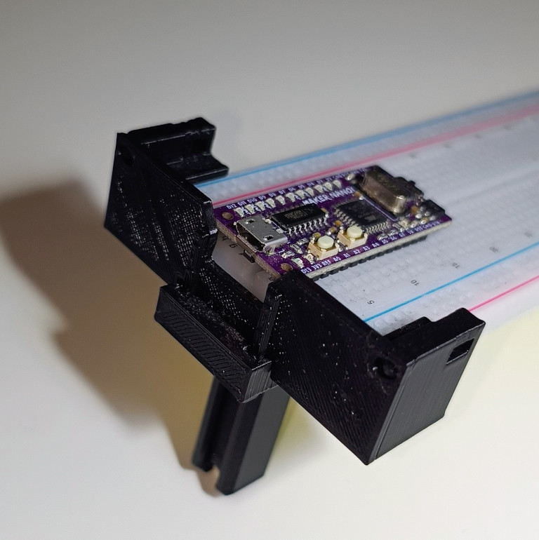

# Robot integration
**Contents**
* toc
{:toc}
You've learned so much. Let's put that into practice and finally build your own robot!

## Introduction
Make sure you printed all elements listed in Bill Of Materials!

describe some engineering aspects, why such decisions

## Pinout

>> Here comes a pinout table and a Fritzing drawing

## Assembly

Full assembly instructions

